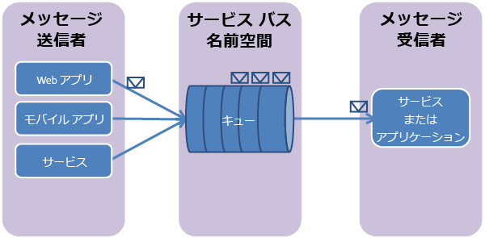

## Service Bus キューとは
Service Bus キューは、**ブローカー メッセージング通信**モデルをサポートしています。 キューを使用すると、分散アプリケーションのコンポーネントが互いに直接通信することがなくなり、仲介者 (ブローカー) の役割を果たすキューを介してメッセージをやり取りすることになります。 メッセージ プロデューサー (送信者) はキューにメッセージを送信した後で、それまでの処理を引き続き実行します。 メッセージ コンシューマー (受信者) は、キューからメッセージを非同期に受信して処理します。 メッセージ プロデューサーは、それ以降のメッセージの処理と送信を続ける場合、メッセージ コンシューマーからの応答を待つ必要がありません。 キューでは、コンシューマーが競合している場合のメッセージ配信に**先入れ先出し法 (FIFO)** を使用します。 つまり、通常はキューに追加された順番にメッセージが受信され、処理されます。このとき、メッセージを受信して処理できるメッセージ コンシューマーは、メッセージ 1 件につき 1 つだけです。

Service Bus キューは汎用テクノロジであり、幅広いシナリオで使用できます。

* 多層 Azure アプリケーションでの Web ロールと Worker ロールとの間の通信。
* ハイブリッド ソリューションでのオンプレミスのアプリと Azure によってホストされるアプリケーションとの間の通信。
* 複数の組織で実行される分散アプリケーションまたは 1 つの組織内の異なる部署でオンプレミスで実行される分散アプリケーションのコンポーネント間の通信。

キューを使用すると、アプリケーションのスケールがより簡単になり、アーキテクチャの復元性が高まります。

