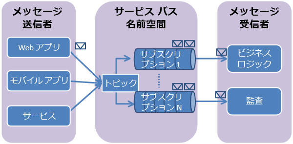

## Service Bus トピックとサブスクリプションとは
Service Bus のトピックとサブスクリプションは、メッセージ通信の *発行/サブスクライブ* モデルをサポートします。 トピックとサブスクリプションを使用すると、分散アプリケーションのコンポーネントが互いに直接通信することがなくなり、仲介者の役割を果たすトピックを介してメッセージをやり取りすることになります。

すべてのメッセージが 1 つのコンシューマーによって処理される Service Bus キューとは異なり、トピックとサブスクリプションでは発行/サブスクライブ パターンを使用した "1 対多" 形式の通信を行います。 複数のサブスクリプションを 1 つのトピックに登録できます。 トピックに送信されたメッセージはサブスクリプションに渡され、各サブスクリプションで独立して処理できます。

トピックにとってのサブスクリプションは、トピックに送信されたメッセージのコピーを受け取る仮想キューのようなものです。 必要に応じて、サブスクリプションごとにトピックのフィルター規則を登録できます。 フィルター規則を使用すると、トピックへのどのメッセージをどのトピック サブスクリプションで受信するかを、フィルター処理したり制限したりできます。

Service Bus のトピックとサブスクリプションを使用することで、多くのユーザーやアプリケーションの間でやり取りされる大量のメッセージを処理することもできます。

[Azure portal]: https://portal.azure.com
[create-namespace]: ./media/howto-service-bus-topics/create-namespace.png
[connection-info]: ./media/howto-service-bus-topics/connection-info.png
[connection-string]: ./media/howto-service-bus-topics/connection-string.png

