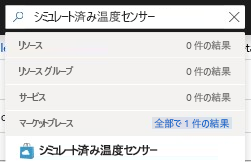

Azure IoT Edge の主要な機能の 1 つは、クラウドから IoT Edge デバイスにモジュールをデプロイできることです。 IoT Edge モジュールは、コンテナーとして実装されている実行可能ファイルのパッケージです。 このセクションでは、[Azure Marketplace の IoT Edge モジュールのセクション](https://azuremarketplace.microsoft.com/en-us/marketplace/apps/category/internet-of-things?page=1&subcategories=iot-edge-modules)から事前に構成したモジュールをデプロイします。 このモジュールは、シミュレートされたデバイスのテレメトリを生成します。

1. Azure portal で、`Simulated Temperature Sensor` を検索に入力して、Marketplace の結果を開きます。

   

2. **[サブスクリプション]** フィールドで、まだ選択されていない場合は、使用している IoT ハブのサブスクリプションを選択します。

3. **[IoT Hub]** フィールドで、まだ選択されていない場合は、使用している IoT ハブの名前を選択します。

4. **[デバイスの検索]** をクリックして、お使いの IoT Edge デバイス (`myEdgeDevice` という名前) を選択してから、**[作成]** を選択します。

5. ウィザードの **[モジュールの追加]** ステップで、**SimulatedTemperatureSensor** モジュールをクリックして構成の設定を確認し、**[保存]** をクリックして **[次へ]** を選択します。

6. ウィザードの **[ルートの指定]** ステップで、ルートがすべてのモジュールから IoT ハブ (`$upstream`) へすべてのメッセージを送信する既定のルートに適切に設定されていることを確認します。 そうしていない場合は、次のコードを追加し、**[次へ]** を選択します。

   ```json
    {
    "routes": {
        "route": "FROM /messages/* INTO $upstream"
        }
    }
   ```

7. ウィザードの **[デプロイの確認]** ステップで、**[送信]** を選びます。

8. デバイスの詳細ページに戻り、**[更新]** を選びます。 最初にサービスを開始したときに作成された edgeAgent モジュールに加えて、**edgeHub** と呼ばれる別のランタイム モジュールと **SimulatedTemperatureSensor** モジュールが一覧表示されます。

   新しいモジュールが表示されるまでに、数分かかる場合があります。 IoT Edge デバイスは、その新しいデプロイ情報をクラウドから取得し、コンテナーを起動した後、その新しい状態を IoT Hub にレポートする必要があります。 

   
