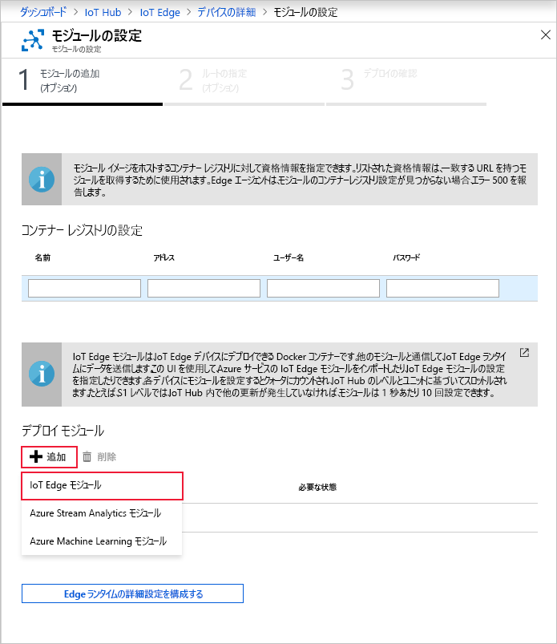
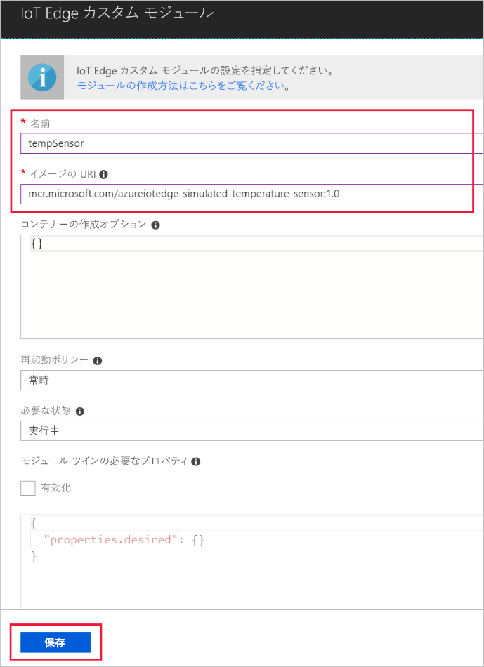

Azure IoT Edge の主要な機能の 1 つは、クラウドから IoT Edge デバイスにモジュールをデプロイできることです。 IoT Edge モジュールは、コンテナーとして実装されている実行可能ファイルのパッケージです。 このセクションでは、シミュレートされたデバイスのテレメトリを生成するモジュールをデプロイします。

1. Azure Portal で、お使いの IoT ハブに移動します。

2. **[デバイスの自動管理]** の **[IoT Edge]** に移動して、使用する IoT Edge デバイスを選択します。

3. **[Set Modules] \(モジュールの設定)** を選択します。 3 つのステップから成るウィザードがポータルに表示され、画面の指示に従ってモジュールを追加し、ルートを指定して、デプロイを確認できます。 

4. ウィザードの **[モジュールの追加]** ステップで、**[デプロイ モジュール]** セクションを見つけます。 **[追加]** をクリックし、**[IoT Edge モジュール]** を選択します。

   

5. **[名前]** フィールドに「`tempSensor`」と入力します。

6. **[イメージの URI]** フィールドに「`mcr.microsoft.com/azureiotedge-simulated-temperature-sensor:1.0`」と入力します。

7. 他の設定はそのままにして、**[保存]** を選びます。

   

8. ウィザードの最初のステップに戻り、**[次へ]** を選択します。

9. ウィザードの **[ルートの指定]** ステップで、すべてのモジュールから IoT Hub にすべてのメッセージを送信する既定のルートを用意しておく必要があります。 そうしていない場合は、次のコードを追加し、**[次へ]** を選択します。

   ```json
   {
       "routes": {
           "route": "FROM /messages/* INTO $upstream"
       }
   }
   ```

10. ウィザードの **[デプロイの確認]** ステップで、**[送信]** を選びます。

11. デバイスの詳細ページに戻り、**[更新]** を選びます。 最初にサービスを開始したときに作成された edgeAgent モジュールに加えて、**edgeHub** と呼ばれる別のランタイム モジュールと **tempSensor** モジュールが一覧表示されます。

   新しいモジュールが表示されるまでに、数分かかる場合があります。 IoT Edge デバイスは、その新しいデプロイ情報をクラウドから取得し、コンテナーを起動した後、その新しい状態を IoT Hub にレポートする必要があります。 

   
