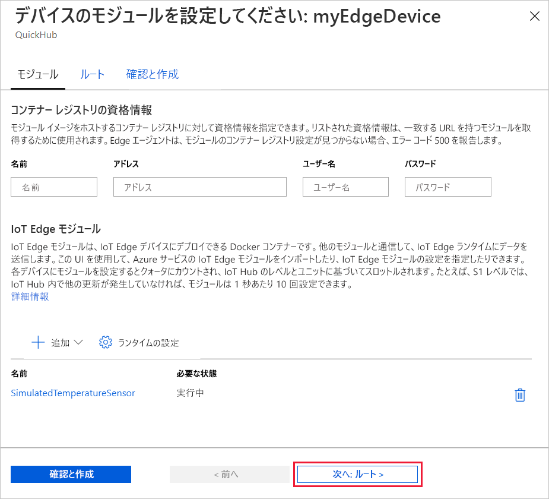
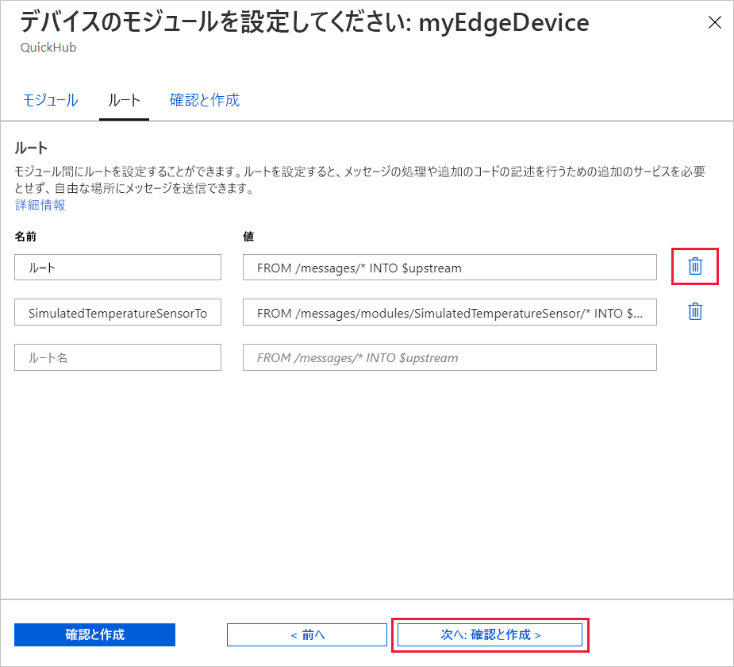
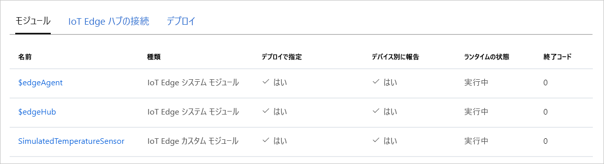

Azure IoT Edge の主要な機能の 1 つは、クラウドからお客様の IoT Edge デバイスにコードをデプロイすることです。 *IoT Edge モジュール* は、コンテナーとして実装されている実行可能ファイルのパッケージです。 このセクションでは、[Azure Marketplace の IoT Edge モジュールのセクション](https://azuremarketplace.microsoft.com/marketplace/apps/category/internet-of-things?page=1&subcategories=iot-edge-modules)のあらかじめ構築されたモジュールを Azure IoT Hub から直接デプロイします。

このセクションでデプロイするモジュールはセンサーをシミュレートし、生成されたデータを送信します。 シミュレートされたデータを開発とテストに使用できるため、このモジュールは IoT Edge の使用を開始する際にコードの一部として役に立ちます。 このモジュールで行われる内容を正確に確認したい場合は、[シミュレートされた温度センサーのソース コード](https://github.com/Azure/iotedge/blob/027a509549a248647ed41ca7fe1dc508771c8123/edge-modules/SimulatedTemperatureSensor/src/Program.cs)をご覧いただけます。

Azure Marketplace からお客様の最初のモジュールをデプロイするには、次の手順に従います。

1. [Azure portal](https://portal.azure.com) にサインインし、お使いの IoT ハブに移動します。

1. 左側のメニューで、 **[デバイスの自動管理]** の下にある **[IoT Edge]** を選択します。

1. デバイスの一覧でターゲット デバイスのデバイス ID を選択します。

1. 上部のバーで **[モジュールの設定]** を選択します。

   ![[モジュールの設定] の選択を示すスクリーンショット。](./media/iot-edge-deploy-module/select-set-modules.png)

1. **[IoT Edge モジュール]** の下で、 **[追加]** ドロップダウン メニューを開き、 **[Marketplace モジュール]** を選択します。

   ![[追加] ドロップダウン メニューを示すスクリーンショット。](./media/iot-edge-deploy-module/add-marketplace-module.png)

1. **[IoT Edge モジュールの Marketplace]** で、`Simulated Temperature Sensor` モジュールを検索して選択します。

   モジュールが [IoT Edge モジュール] セクションに追加されており、[必要な状態] が **[実行しています]** になっています。

1. **次へ:ルート** を選択し、ウィザードの次の手順に進みます。

   

1. **[ルート]** タブで、既定のルートの **route** を削除し、 **[次へ: 確認と作成]** を選択し、ウィザードの次の手順に進みます。

   >[!Note]
   >ルートは、名前と値のペアを使用して作成されます。 このページには 2 つのルートが表示されるはずです。 既定のルートの **route** では、すべてのメッセージが IoT Hub (名前は `$upstream`) に送信されます。 2 つ目のルート **SimulatedTemperatureSensorToIoTHub** は、Azure Marketplace からモジュールを追加したときに自動的に作成されました。 このルートでは、シミュレートされた温度モジュールから IoT Hub にすべてのメッセージが送信されます。 この場合、既定のルートは冗長となるため、削除できます。

   

1. JSON ファイルを確認し、 **[作成]** を選択します。 この JSON ファイルには、IoT Edge デバイスにデプロイするすべてのモジュールが定義されます。 **SimulatedTemperatureSensor** モジュールに加え、**edgeAgent** と **edgeHub** という 2 つのランタイム モジュールが含まれています。

   >[!Note]
   >IoT Edge デバイスに新しいデプロイを送信しても、デバイスには何もプッシュされません。 代わりに、デバイスから IoT Hub に対して、新しい指示のクエリが定期的に実行されます。 更新されたデプロイ マニフェストがデバイスによって検出されると、新しいデプロイに関する情報が使用されてクラウドからモジュール イメージがプルされ、ローカルでのモジュールの実行が開始されます。 このプロセスには数分かかることがあります。

1. モジュールのデプロイの詳細が作成されると、ウィザードは [デバイスの詳細] ページに戻ります。 **[モジュール]** タブでデプロイの状態を確認します。

   **$edgeAgent**、 **$edgeHub**、および **SimulatedTemperatureSensor** という 3 つのモジュールが表示されています。 **[デバイス別に報告]** ではなく **[デプロイで指定]** の下に **[はい]** となっているモジュールが 1 つ以上ある場合、それらはまだお客様の IoT Edge デバイスによって起動されている途中です。 数分待ってから、ページを更新します。

   
