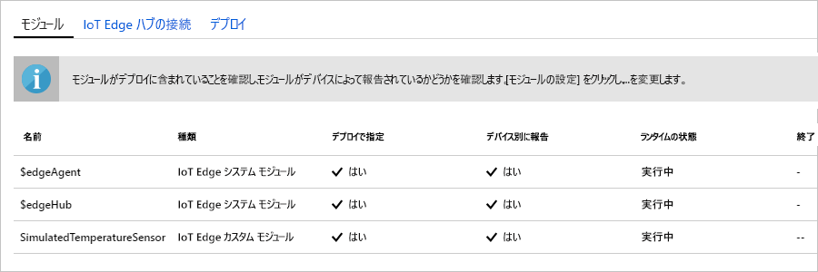

Azure IoT Edge の主要な機能の 1 つは、クラウドから IoT Edge デバイスにモジュールをデプロイできることです。 IoT Edge モジュールは、コンテナーとして実装されている実行可能ファイルのパッケージです。 このセクションでは、[Azure Marketplace の IoT Edge モジュールのセクション](https://azuremarketplace.microsoft.com/marketplace/apps/category/internet-of-things?page=1&subcategories=iot-edge-modules)から事前に構成したモジュールをデプロイします。 このモジュールからは、IoT Edge デバイスのシミュレートされたテレメトリが生成されます。

1. [Azure portal](https://portal.azure.com) で、「**Simulated Temperature Sensor**」と検索に入力し、Marketplace の結果を開きます。

   

2. モジュールを受け取る IoT Edge デバイスを選択します。 **[IoT Edge モジュールのターゲット デバイス]** に次の情報を指定します。

   1. **サブスクリプション**: 使用している IoT ハブを含むサブスクリプションを選択します。

   2. **IoT Hub**: 使用している IoT ハブ の名前を選択します。

   3. **IoT Edge デバイス名**: このクイック スタートで提案されているデバイス名を使用した場合は、「**myEdgeDevice**」と入力します。 または、**[デバイスの検索]** を選択して、IoT ハブのデバイス一覧から選択します。 
   
   4. **作成**を選択します。

3. これで、Azure Marketplace から IoT Edge モジュールを選択し、モジュールを受け取る IoT Edge デバイスを選択する手順は完了です。次は、モジュールのデプロイ方法を正確に定義するために役立つ 3 つの手順のウィザードに進みます。 ウィザードの **[モジュールの追加]** 手順で、**SimulatedTemperatureSensor** モジュールが自動的に設定されていることに注目してください。 このチュートリアルでは、このページを使用して新しいモジュールをデプロイに追加します。 このクイック スタートでは、この 1 つのモジュールのみをデプロイします。 **[次へ]** を選択して、ウィザードの次の手順に進みます。

4. ウィザードの **[ルートの指定]** 手順で、モジュール間と IoT Hub に対してメッセージが渡される方法を定義します。 このクイック スタートでは、すべてのモジュールのすべてのメッセージを IoT Hub (`$upstream`) に送信します。 自動的に設定されていない場合は、次のコードを追加し、**[次へ]** を選択します。

   ```json
    {
    "routes": {
        "route": "FROM /messages/* INTO $upstream"
        }
    }
   ```

5. ウィザードの **[デプロイの確認]** 手順では、IoT Edge デバイスにデプロイされているすべてのモジュールを定義する JSON ファイルをプレビューできます。 **SimulatedTemperatureSensor** モジュールだけでなく、**edgeAgent** と **edgeHub** という 2 つの追加システム モジュールが含まれていることに注目してください。 確認が完了したら、**[送信]** を選択します。

   IoT Edge デバイスに新しいデプロイを送信しても、デバイスには何もプッシュされません。 代わりに、デバイスから IoT Hub に対して、新しい指示のクエリが定期的に実行されます。 新しいデプロイ情報が表示されると、デバイスではそれを使用してクラウドからモジュール イメージを取得し、モジュールのローカルでの実行を開始します。 このプロセスは数分かかることがあります。 

6. モジュールのデプロイの詳細を送信すると、ウィザードは IoT ハブの **[IoT Edge]** ページに戻ります。 IoT Edge デバイスの一覧からデバイスを選択すると、その詳細が表示されます。 

7. デバイスの詳細ページで、**[モジュール]** セクションまで下にスクロールします。 $edgeAgent、$edgeHub、SimulatedTemperatureSensor という 3 つのモジュールが表示されているはずです。 デプロイには指定され、デバイスからは報告されていないという表示のモジュールが 1 つ以上ある場合は、IoT Edge デバイスでまだ起動中であることを示します。 少し待ってから、ページの上部にある **[更新]** をクリックします。 

   
