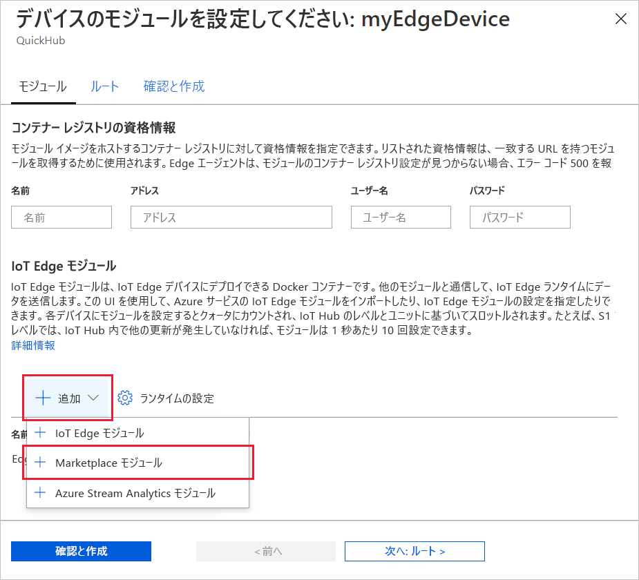

Azure IoT Edge の主要な機能の 1 つは、クラウドからお客様の IoT Edge デバイスにコードをデプロイできることです。 *IoT Edge モジュール*は、コンテナーとして実装されている実行可能ファイルのパッケージです。 このセクションでは、[Azure Marketplace の IoT Edge モジュールのセクション](https://azuremarketplace.microsoft.com/marketplace/apps/category/internet-of-things?page=1&subcategories=iot-edge-modules)で事前に構築したモジュールを、Azure IoT ハブから直接デプロイします。

このセクションでデプロイするモジュールはセンサーをシミュレートし、生成されたデータを送信します。 シミュレートされたデータを開発とテストに使用できるため、このモジュールは IoT Edge の使用を開始する際にコードの一部として役に立ちます。 このモジュールで行われる内容を正確に確認したい場合は、[シミュレートされた温度センサーのソース コード](https://github.com/Azure/iotedge/blob/027a509549a248647ed41ca7fe1dc508771c8123/edge-modules/SimulatedTemperatureSensor/src/Program.cs)をご覧いただけます。

Azure Marketplace からお客様の最初のモジュールをデプロイするには、次の手順を使用します。

1. [Azure Portal](https://portal.azure.com) にサインインし、IoT Hub に移動します。

1. 左側のペインのメニューで、 **[デバイスの自動管理]** の下にある **[IoT Edge]** を選択します。

1. デバイスの一覧でターゲット デバイスのデバイス ID をクリックします。

1. 上部のバーで **[モジュールの設定]** を選択します。

   ![[デバイスの詳細] ページから [モジュールの設定] を選択する](./media/iot-edge-deploy-module/select-set-modules.png)

1. このページの **[IoT Edge モジュール]** セクションで、 **[追加]** をクリックし、ドロップダウンメニューから **[Marketplace モジュール]** を選択します。

   

1. **[IoT Edge モジュールの Marketplace]** で、"シミュレートされた温度センサー" を検索し、そのモジュールを選択します。

1. SimulatedTemperatureSensor モジュールが [IoT Edge モジュール] セクションに追加されており、[必要な状態] が **[実行しています]** になっていることにご注目ください。

   **次へ:ルート** を選択し、ウィザードの次の手順に進みます。

   

1. ウィザードの **[ルート]** タブで、モジュールと IoT ハブの間でメッセージが渡される方法を定義できます。 ルートは名前と値のペアを使用して作成されます。 このページには 2 つのルートが表示されるはずです。 **route** という名前の既定のルートから IoT Hub (名前は `$upstream`) にすべてのメッセージが送信されます。 Marketplace からモジュールを追加したとき、**SimulatedTemperatureSensorToIoTHub** という名前の 2 つ目のルートが自動的に作成されました。 このルートによって、特に、シミュレートされた温度モジュールから IoT Hub にすべてのメッセージが送信されます。 この場合、既定のルートは冗長となるため、削除できます。

   **次へ:確認と作成** を選択し、ウィザードの次の手順に進みます。

   

1. ウィザードの **[確認と作成]** タブでは、IoT Edge デバイスにデプロイされているすべてのモジュールを定義する JSON ファイルをプレビューできます。 **SimulatedTemperatureSensor** モジュールに加え、**edgeAgent** と **edgeHub** という 2 つのランタイム モジュールが含まれていることに注目してください。 確認が完了したら **[作成]** を選択します。

   IoT Edge デバイスに新しいデプロイを送信しても、デバイスには何もプッシュされません。 代わりに、デバイスから IoT Hub に対して、新しい指示のクエリが定期的に実行されます。 更新されたデプロイ マニフェストがデバイスによって検出されると、新しいデプロイに関する情報が使用されてクラウドからモジュール イメージがプルされ、ローカルでのモジュールの実行が開始されます。 このプロセスは数分かかることがあります。

1. モジュールのデプロイの詳細が作成されると、ウィザードは [デバイスの詳細] ページに戻ります。 [デバイスの詳細] ページの **[モジュール]** タブでデプロイの状態を確認します。$edgeAgent、$edgeHub、SimulatedTemperatureSensor という 3 つのモジュールが表示されているはずです。 デプロイで指定されたとおりに表示されているのにデバイスによってレポートされていないモジュールが 1 つ以上ある場合、それらはまだお客様の IoT Edge デバイスによって起動中です。 少し待ってから、ページの上部にある **[更新]** をクリックします。

   
