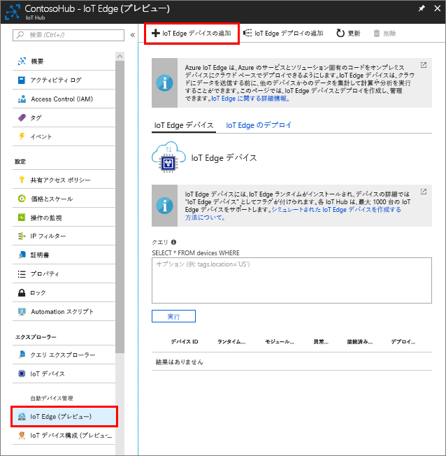

お使いの IoT ハブと通信できるようにシミュレートされたデバイスのデバイス ID を作成します。 IoT Edge デバイスは、一般的な IoT デバイスとは異なる動作をし、別に管理できるため、IoT Edge デバイスであることを最初から宣言します。 

1. Azure Portal で、お使いの IoT ハブに移動します。
1. **[IoT Edge (preview)]\(IoT Edge (プレビュー)\)** を選択してから **[Add IoT Edge Device]\(IoT Edge デバイスの追加\)** を選択します。

   

1. シミュレートされたデバイスに一意のデバイス ID を付与します。
1. **[保存]** を選択して、お使いのデバイスを追加します。
1. デバイスの一覧から、お使いの新しいデバイスを選択します。
1. **[接続文字列 - 主キー]** の値をコピーして保存します。 次のセクションで、IoT Edge ランタイムを構成するときにこの値を使用します。 

