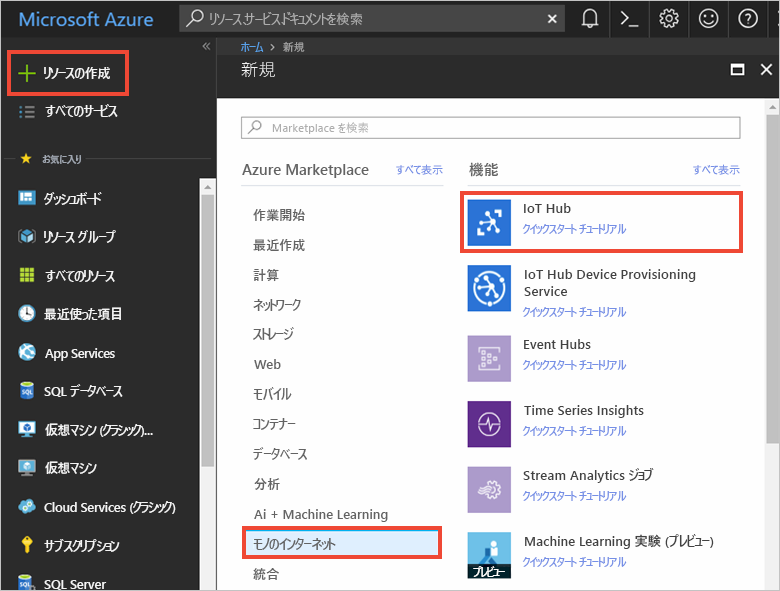
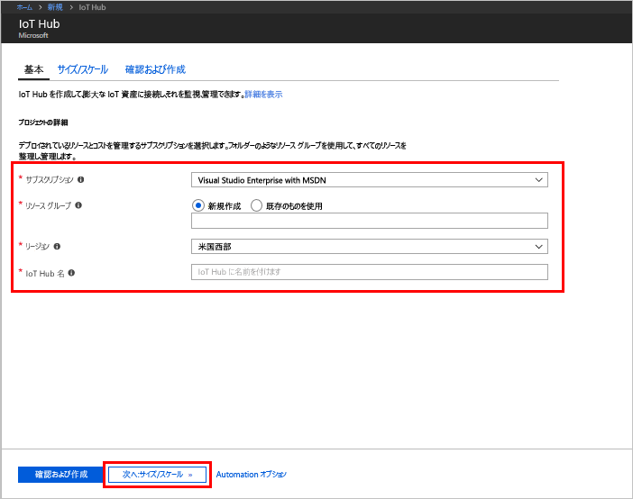
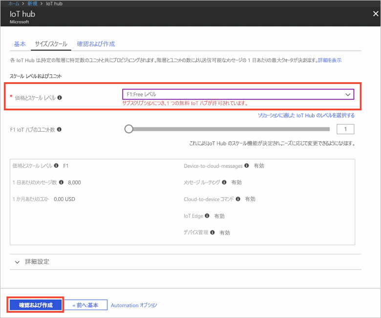

1. [Azure Portal](https://portal.azure.com/) にサインインします。

2. **[リソースの作成]** > **[モノのインターネット]** > **[IoT Hub]** を選択します。
   
    

3. **[IoT Hub]** ウィンドウで、IoT Hub のために以下の情報を入力します。

   * **[サブスクリプション]**: この IoT ハブを作成するために使用するサブスクリプションを選択します。

   * **[リソース グループ]**: IoT Hub をホストするリソース グループを作成するか、既存のリソース グループを使用します。 詳細については、[リソース グループを使用した Azure リソースの管理](../articles/azure-resource-manager/resource-group-portal.md)に関するページを参照してください。

   * **[リージョン]**: 最も近い場所を選択します。

   * **[名前]**: IoT ハブの名前を作成します。 入力した名前が使用可能な場合は、緑色のチェック マークが表示されます。

   [!INCLUDE [iot-hub-pii-note-naming-hub](iot-hub-pii-note-naming-hub.md)]

   

4. **[Next: Size and scale]\(次へ: サイズとスケール\)** を選択して、IoT ハブの作成を続けます。 

5. **[価格とスケールティア]** を選択します。 この記事では、**[F1 - Free]** レベルを選択します (サブスクリプションで引き続き使用可能な場合)。 詳細については、[料金とスケール レベル](https://azure.microsoft.com/pricing/details/iot-hub/)に関するページを参照してください。

   

6. **[Review + create]\(レビュー + 作成\)** を選択します。

7. IoT ハブの情報を確認してから、**[作成]** をクリックします。 IoT ハブの作成には数分かかることがあります。 **[通知]** ウィンドウで進行状況を監視できます。