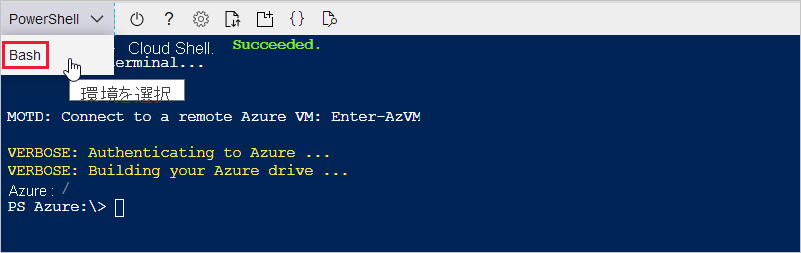

以降のセクションでは、ターミナルを設定し、Azure CLI を使用して IoT ハブを設定します。 Azure CLI コマンドを実行するターミナルを構成するには、ブラウザーベースの Azure Cloud Shell を使用するか、またはローカル ターミナルを使用してください。
* Cloud Shell を使用するには、次のセクション「[Cloud Shell を起動する](#launch-the-cloud-shell)」に進みます。 
* ローカル ターミナルを使用するには、次のセクションをスキップし、「[ローカル ターミナルを開く](#open-a-local-terminal)」に進みます。

## <a name="launch-the-cloud-shell"></a>Cloud Shell を起動する
このセクションでは、Cloud Shell セッションを作成し、ターミナル環境を構成します。

Azure Portal ( https://portal.azure.com ) にサインインします。  

Cloud Shell を起動するには以下を行います。

1. Azure portal の右上にあるメニュー バーの **[Cloud Shell]** ボタンを選択します。 

    ![Azure portal の [Cloud Shell] ボタン](media/iot-hub-include-create-hub-cli/cloud-shell-button.png)

    > [!NOTE]
    > Cloud Shell を初めて使用する場合は、Cloud Shell を使用するために必要なストレージを作成するように求められます。  ストレージ アカウントと Microsoft Azure ファイル共有を作成するためのサブスクリプションを選択します。 

2. **[環境の選択]** ドロップダウンで、優先する CLI 環境を選択します。 このクイックスタートでは、**Bash** 環境を使用します。 次の CLI コマンドはすべて、PowerShell 環境でも動作します。 

    

3. 次のセクションをスキップし、「[Azure IoT 拡張機能をインストールする](#install-the-azure-iot-extension)」に進みます。 

## <a name="open-a-local-terminal"></a>ローカル ターミナルを開く
Cloud Shell ではなくローカル ターミナルを使用する場合は、このセクションの手順を実行します。  

1. ローカル ターミナルを開きます。
1. [az login](/cli/azure/reference-index#az_login) コマンドを実行します。

   ```azurecli
   az login
   ```

    CLI で既定のブラウザーを開くことができる場合、開いたブラウザに Azure サインイン ページが読み込まれます。

    それ以外の場合は、 https://aka.ms/devicelogin でブラウザー ページを開き、ターミナルに表示されている認証コードを入力します。

    Web ブラウザーが使用できないか、Web ブラウザーを開けない場合は、`az login --use-device-code` でデバイス コード フローを使用します。

1. ブラウザーでアカウントの資格情報を使用してサインインします。

    さまざまな認証方法の詳細については、「[Azure CLI を使用してサインインする]( /cli/azure/authenticate-azure-cli )」を参照してください。

1. 次のセクション「[Azure IoT 拡張機能をインストールする](#install-the-azure-iot-extension)」に進みます。 

## <a name="install-the-azure-iot-extension"></a>Azure IoT 拡張機能をインストールする
このセクションでは、Azure CLI 用の Microsoft Azure IoT 拡張機能を CLI シェルにインストールします。 IoT Hub、IoT Edge、IoT Device Provisioning Service (DPS) 固有のコマンドが Azure CLI に追加されます。

> [!IMPORTANT]
> 以降このクイックスタートに出現するターミナル コマンドは、Cloud Shell でもローカル ターミナルでも同じように機能します。 コマンドを実行するには、 **[コピー]** を選択してこのクイックスタートのコード ブロックをコピーします。 それを CLI シェルに貼り付けて実行します。

[az extension add](/cli/azure/extension#az_extension_add) コマンドを実行します。 

   ```azurecli
   az extension add --name azure-iot
   ```
[!INCLUDE [iot-hub-cli-version-info](iot-hub-cli-version-info.md)]

## <a name="create-an-iot-hub"></a>IoT Hub の作成
このセクションでは、Azure CLI を使用して IoT ハブとリソース グループを作成します。  Azure リソース グループとは、Azure リソースのデプロイと管理に使用する論理コンテナーです。 IoT ハブは、IoT アプリケーションとデバイスの間の双方向通信に対する中央メッセージ ハブとして機能します。 

IoT ハブとリソース グループを作成するには、次のようにします。

1. [az group create](/cli/azure/group#az_group_create) コマンドを実行してリソース グループを作成します。 次のコマンドは、*myResourceGroup* という名前のリソース グループを *eastus* という場所に作成します。 
    >[!NOTE]
    > 必要に応じて、別の場所を設定することもできます。 選択できる場所を確認するには、`az account list-locations` を実行します。 コマンド例を見るとわかるように、このチュートリアルでは *eastus* を使用しています。 

    ```azurecli
    az group create --name MyResourceGroup --location eastus
    ```

1. [az iot hub create](/cli/azure/iot/hub#az_iot_hub_create) コマンドを実行して、IoT ハブを作成します。 IoT ハブの作成には数分かかることがあります。 

    *YourIotHubName*: 以下のコマンドでは、このプレースホルダーとその前後の中かっこを実際の IoT ハブの名前に置き換えます。 IoT ハブ名は Azure でグローバルに一意である必要があります。 以降、このクイックスタートに出現しているプレースホルダーにはすべて、実際の IoT ハブの名前を使用してください。

    ```azurecli
    az iot hub create --resource-group MyResourceGroup --name {YourIoTHubName}
    ```

## <a name="create-a-simulated-device"></a>シミュレート対象デバイスを作成します
このセクションでは、IoT ハブに接続された、シミュレートされた IoT デバイスを作成します。 

シミュレートされたデバイスを作成するには:
1. CLI シェルで、[az iot hub device-identity create](/cli/azure/ext/azure-iot/iot/hub/device-identity#ext-azure-iot-az-iot-hub-device-identity-create) コマンドを実行します。 これにより、シミュレートされたデバイスを作成します。 

    *YourIotHubName*: このプレースホルダーは、実際の IoT Hub に対して選んだ名前に置き換えてください。 

    *myDevice*。 この記事の残りの部分では、シミュレートされたデバイスの ID に対してこの名前を直接使用できます。 別の名前を使用することもできます。 

    ```azurecli
    az iot hub device-identity create --device-id myDevice --hub-name {YourIoTHubName} 
    ```

1.  [az iot hub device-identity connection-string show](/cli/azure/ext/azure-iot/iot/hub/device-identity/connection-string#ext_azure_iot_az_iot_hub_device_identity_connection_string_show) コマンドを実行します。 

    ```azurecli
    az iot hub device-identity connection-string show --device-id myDevice --hub-name {YourIoTHubName}
    ```

    接続文字列出力は次の形式です。

    ```Output
    HostName=<your IoT Hub name>.azure-devices.net;DeviceId=<your device id>;SharedAccessKey=<some value>
    ```

1. 接続文字列を安全な場所に保存します。 

> [!NOTE]
> CLI シェルは開いたままにしておいてください。 これは後の手順で使用します。