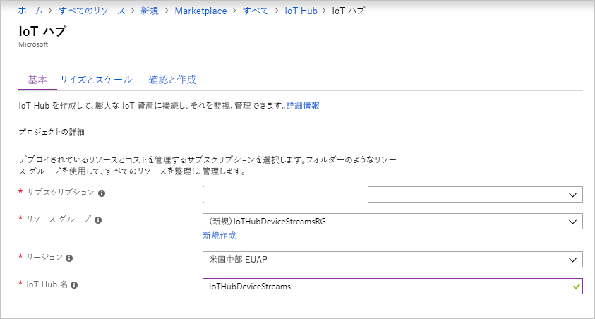

このセクションでは、[Azure portal](https://portal.azure.com) を使用して IoT ハブを作成する方法について説明します。

1. [Azure Portal](https://portal.azure.com) にサインインします。

1. **[リソースの作成]** をクリックし、 **[モノのインターネット]** を選択します。

1. 右側にある一覧で、 **[IoT ハブ]** を選択します。 IoT ハブを作成するための最初のページが開きます。

   

   フィールドに入力します。

   a. **[サブスクリプション]** ボックスの一覧で、自分の IoT ハブに使用するサブスクリプションを選択します。

   b. **[リソース グループ]** で、次のいずれかを行います。 
      * 新しいリソース グループを作成するには、 **[新規作成]** を選択し、自分が使用したい名前を入力します。 
      * 既存のリソース グループを使用するには、 **[既存のものを使用]** を選択し、ドロップダウン リストでリソース グループを選択します。 
      
        詳しくは、[「Manage Azure Resource Manager resource groups (Azure Resource Manager のリソース グループの管理)](../articles/azure-resource-manager/manage-resource-groups-portal.md)」をご覧ください。

   c. **[リージョン]** ボックスの一覧で、自分のハブを配置したいリージョンを選択します。 IoT Hub デバイス ストリーム (プレビュー) がサポートされているリージョンとして、 **[米国中部]** または **[米国中部 EUAP]** を選択します。

   d. **[IoT ハブ名]** ボックスに IoT ハブの名前を入力します。 名前はグローバルに一意である必要があります。 入力した名前が使用可能な場合は、緑色のチェック マークが表示されます。

   [!INCLUDE [iot-hub-pii-note-naming-hub](iot-hub-pii-note-naming-hub.md)]

1. IoT ハブの作成を続けるには、 **[次へ: サイズとスケール]** を選択します。

   

   このウィンドウでは、既定の設定をそのまま使用して、下部にある **[確認と作成]** を選択することができます。 以下のオプションを検討します。

   * **[価格とスケールティア]** ボックスの一覧で、Standard レベルのいずれか (**S1**、**S2**、または **S3**) または **[F1: Free レベル]** を選択します。 この選択は、フリートのサイズと、ハブで予想されるストリーミング以外のワークロード (テレメトリ メッセージなど) によっても左右されます。 たとえば、無料レベルは、テストおよび評価用です。 IoT Hub に接続できるデバイスは 500 個で、1 日に許可されるメッセージ数は最大 8,000 件です。 Azure サブスクリプションごとに、Free レベルの IoT ハブを 1 つ作成できます。 

   * **[IoT Hub のユニット数]** : この選択は、ハブで予想されるストリーミング以外のワークロードによって決まります。 ここでは 1 を選択してかまいません。

   レベルのオプションの詳細については、[適切な IoT Hub レベルの選択](../articles/iot-hub/iot-hub-scaling.md)に関する記事を参照してください。

1. 選択内容を確認するには、 **[確認と作成]** タブを選択します。次のようなウィンドウが開きます。

   

1. 新しい IoT ハブを作成するには、 **[作成]** をクリックします。 このプロセスには数分かかります。
