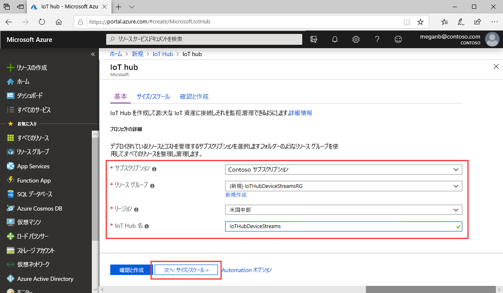
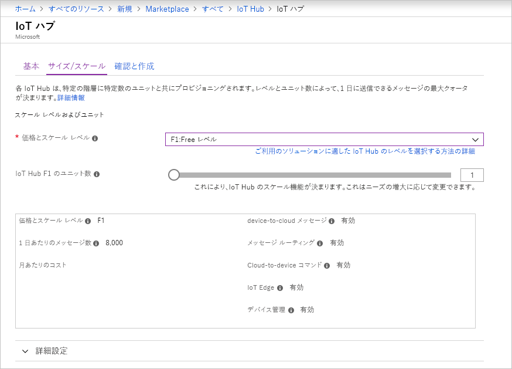
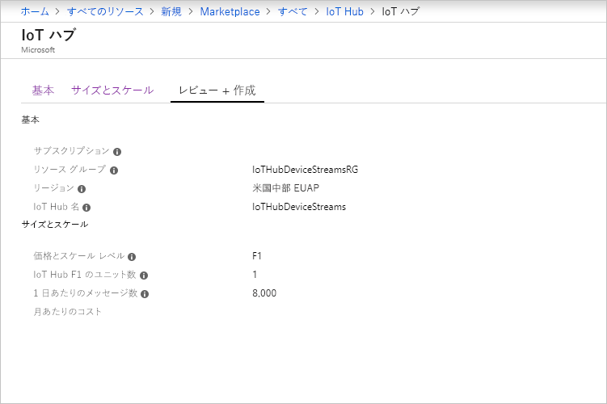

ここでは、[Azure portal](https://portal.azure.com) を使用して IoT ハブを作成する方法について説明します。

1. [Azure portal](https://portal.azure.com) にサインインする

1. **[リソースの作成]** を選択してから、 **[Marketplace を検索]** フィールドに *IoT Hub* を入力します。

1. 検索結果の **[IoT Hub]** を選択し、 **[作成]** を選択します。

1. **[基本]** タブで、次のように各フィールドに入力します。

   - **サブスクリプション**:ハブで使用するサブスクリプションを選択します。

   - **リソース グループ**:リソース グループを選択するか、新しく作成します。 新たに作成するには、 **[新規作成]** を選択して、使用する名前を入力します。 既存のリソース グループを使用するには、そのリソース グループを選択します。 詳しくは、[「Manage Azure Resource Manager resource groups (Azure Resource Manager のリソース グループの管理)](../articles/azure-resource-manager/management/manage-resource-groups-portal.md)」をご覧ください。

   - **[リージョン]** :ハブを配置するリージョンを選択します。 IoT Hub デバイス ストリーム (プレビュー) がサポートされているリージョンとして、 **[米国中部]** または **[米国中部 EUAP]** を選択します。

   - **[IoT Hub 名]** : ハブの名前を入力します。 この名前はグローバルに一意である必要があります。 入力した名前が使用可能な場合は、緑色のチェック マークが表示されます。

   

   [!INCLUDE [iot-hub-pii-note-naming-hub](iot-hub-pii-note-naming-hub.md)]

1. **[次へ:Size and scale]\(次へ: サイズとスケール\)** を選択して、ハブの作成を続けます。

   

   **[サイズとスケール]** では、既定の設定を受け入れて、下部にある **[確認および作成]** を選択することができます。 次のオプションを検討してください。

   - **[価格とスケールティア]** : 選択したレベル。 Standard レベルのいずれか (**S1**、**S2**、または **S3**) または **[F1: Free レベル]** を選択します。 この選択は、フリートのサイズと、ハブで予想されるストリーミング以外のワークロード (テレメトリ メッセージなど) によっても左右されます。 たとえば、無料レベルは、テストおよび評価用です。 IoT Hub に接続できるデバイスは 500 個で、1 日に許可されるメッセージ数は最大 8,000 件です。 Azure サブスクリプションごとに、Free レベルの IoT ハブを 1 つ作成できます。 

   - **[IoT Hub のユニット数]** : ユニットごとに許可される 1 日あたりのメッセージの数は、ハブの価格レベルによって決まります。 この選択は、ハブで予想されるストリーミング以外のワークロードによって決まります。 ここでは 1 を選択してかまいません。

   - **[詳細設定]**  >  **[Device-to-cloud パーティション]** : このプロパティでは、device-to-cloud メッセージがそのメッセージの同時閲覧者数に関連付けられます。 ほとんどのハブでは、4 つのパーティションのみが必要となります。

   レベルのオプションの詳細については、[適切な IoT Hub レベルの選択](../articles/iot-hub/iot-hub-scaling.md)に関する記事を参照してください。

1. 選択内容を確認するには、 **[確認および作成]** をクリックします。 結果は次のようになります。

   

1. 新しい IoT ハブを作成するには、 **[作成]** をクリックします。 このプロセスには数分かかります。
