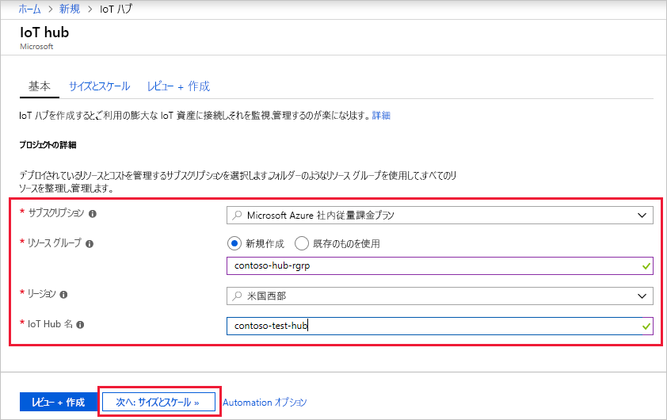
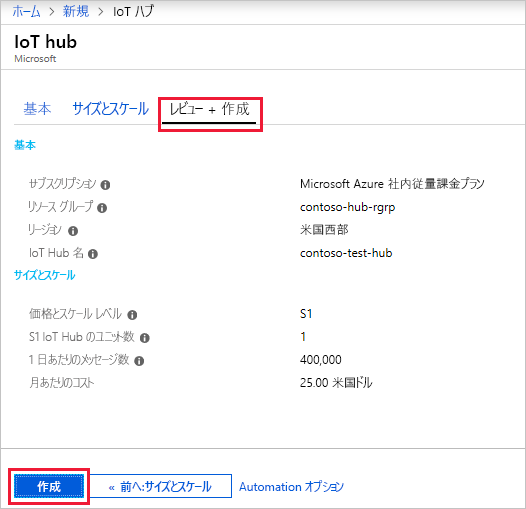

ここでは、[Azure portal](https://portal.azure.com) を使用して IoT ハブを作成する方法について説明します。

1. [Azure Portal](https://portal.azure.com) にログインします。 

2. [+ **リソースの作成]**、**[モノのインターネット]** の順に選択します。

3. 右側のリストにある **[Iot Hub]** をクリックします。 IoT ハブを作成するための最初の画面が表示されます。

   

   フィールドに入力します。

   **サブスクリプション**:IoT ハブで使用するサブスクリプションを選択します。

   **リソース グループ**:新しいリソース グループを作成するか、既存のリソース グループを使用することができます。 新しいものを作成するには、**[新規作成]** をクリックして、使用する名前を入力します。 既存のグループを使用するには、**[既存のものを使用]** をクリックし、ドロップダウン リストからリソース グループを選択します。 詳しくは、[「Manage Azure Resource Manager resource groups (Azure Resource Manager のリソース グループの管理)](../articles/azure-resource-manager/manage-resource-groups-portal.md)」をご覧ください。

   **[リージョン]**:ハブを配置するリージョンです。 最も近い場所をドロップダウン リストから選択します。

   **[IoT Hub 名]**: IoT Hub の名前を入力します。 この名前はグローバルに一意である必要があります。 入力した名前が使用可能な場合は、緑色のチェック マークが表示されます。

   [!INCLUDE [iot-hub-pii-note-naming-hub](iot-hub-pii-note-naming-hub.md)]

4. **[次へ: Size and scale]\(次へ: サイズとスケール\)** をクリックして、IoT ハブの作成を続けます。

   

   この画面では、既定値を使用して、下部にある **[確認および作成]** をクリックするだけです。 

   **[価格とスケールティア]**: 必要な機能およびソリューションで 1 日に送信するメッセージの数に応じて、複数のレベルから適切なものを選びます。 無料レベルは、テストおよび評価用です。 IoT Hub に接続できるデバイスは 500 個で、1 日に許可されるメッセージ数は最大 8,000 件です。 Azure サブスクリプションごとに、無料レベルの IoT Hub を 1 つ作成できます。 

   **[IoT Hub ユニット]**: ユニットごとに許可される 1 日あたりのメッセージの数は、ハブの価格レベルによって決まります。 たとえば、IoT Hub で 700,000 件の受信メッセージをサポートする場合は、S1 レベルのユニットを 2 つ選択します。

   他のレベルのオプションについて詳しくは、[適切な IoT Hub レベルの選択](../articles/iot-hub/iot-hub-scaling.md)に関するページをご覧ください。

   **高度なパーティション/Device-to-cloud パーティション**: このプロパティでは、device-to-cloud メッセージがそのメッセージの同時閲覧者数に関連付けられます。 ほとんどの IoT ハブでは、4 つのパーティションのみが必要となります。 

5. **[確認および作成]** をクリックして、選択内容を確認します。 次の画面のようになります。

   

6. **[作成]** をクリックして、新しい IoT ハブを作成します。 ハブの作成には数分かかります。
