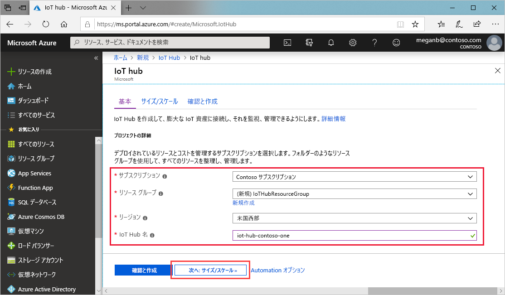
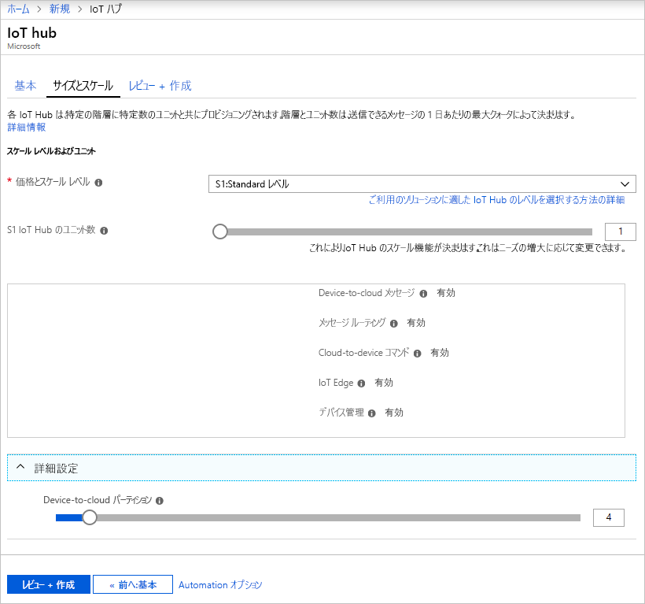
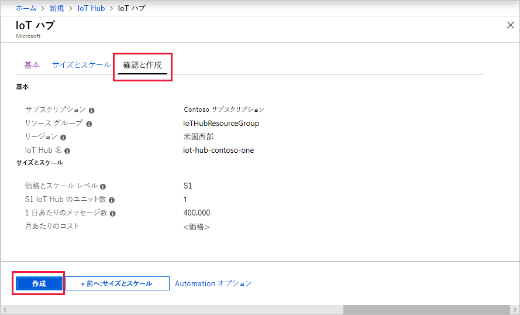

ここでは、[Azure portal](https://portal.azure.com) を使用して IoT ハブを作成する方法について説明します。

1. [Azure Portal](https://portal.azure.com) にサインインします。

1. Azure ホームページから **[+ リソースの作成]** ボタンを選択し、 **[Marketplace を検索]** フィールドに「*IoT Hub*」と入力します。

1. 検索結果の **[IoT Hub]** を選択し、 **[作成]** を選択します。

1. **[基本]** タブで、次のように各フィールドに入力します。

   - **サブスクリプション**:ハブで使用するサブスクリプションを選択します。

   - **リソース グループ**:リソース グループを選択するか、新しく作成します。 新たに作成するには、 **[新規作成]** を選択して、使用する名前を入力します。 既存のリソース グループを使用するには、そのリソース グループを選択します。 詳しくは、[「Manage Azure Resource Manager resource groups (Azure Resource Manager のリソース グループの管理)](../articles/azure-resource-manager/manage-resource-groups-portal.md)」をご覧ください。

   - **[リージョン]** :ハブを配置するリージョンを選択します。 ユーザーに最も近い場所を選択します。

   - **[IoT Hub 名]** : ハブの名前を入力します。 この名前はグローバルに一意である必要があります。 入力した名前が使用可能な場合は、緑色のチェック マークが表示されます。

   [!INCLUDE [iot-hub-pii-note-naming-hub](iot-hub-pii-note-naming-hub.md)]

   

1. **[次へ:Size and scale]\(次へ: サイズとスケール\)** を選択して、ハブの作成を続けます。

   

    この画面では、以下の値を設定できます。

    - **[価格とスケールティア]** : 選択したレベル。 必要な機能およびソリューションで 1 日に送信するメッセージの数に応じて、複数のレベルから適切なものを選びます。 無料レベルは、テストおよび評価用です。 ハブに接続できるデバイスは 500 個で、1 日に許可されるメッセージ数は最大 8,000 件です。 Azure サブスクリプションごとに、Free レベルの IoT ハブを 1 つ作成できます。

    - **[IoT Hub ユニット]** : ユニットごとに許可される 1 日あたりのメッセージの数は、ハブの価格レベルによって決まります。 たとえば、ハブで 700,000 件のイングレス メッセージをサポートする場合は、S1 レベルのユニットを 2 つ選択します。
    他のレベルのオプションについて詳しくは、[適切な IoT Hub レベルの選択](../articles/iot-hub/iot-hub-scaling.md)に関するページをご覧ください。

    - **[詳細設定]**  >  **[Device-to-cloud パーティション]** : このプロパティでは、device-to-cloud メッセージがそのメッセージの同時閲覧者数に関連付けられます。 ほとんどのハブでは、4 つのパーティションのみが必要となります。

1. この記事では、既定の選択のままにして、 **[確認および作成]** を選択して選択内容を確認します。 次の画面のようになります。

   

1. **[作成]** を選択して、新しいハブを作成します。 ハブの作成には数分かかります。
