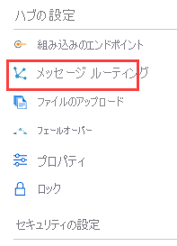

エンドポイントとメッセージのルートを設定したら、その構成をポータルで確認できます。 [Azure portal](https://portal.azure.com) にサインインし、 **[リソース グループ]** に移動します。 次に、目的のリソース グループを選択し、該当するハブを選択します (このチュートリアルのハブ名は `ContosoTestHub` で始まります)。 [IoT Hub] ウィンドウが表示されます。

[IoT Hub] のオプションで、 **[メッセージ ルーティング]** を選択します。 設定したルートが正しく表示されます。

**[メッセージ ルーティング]** 画面で **[カスタム エンドポイント]** を選択すると、そのルートに対して定義したエンドポイントが表示されます。

