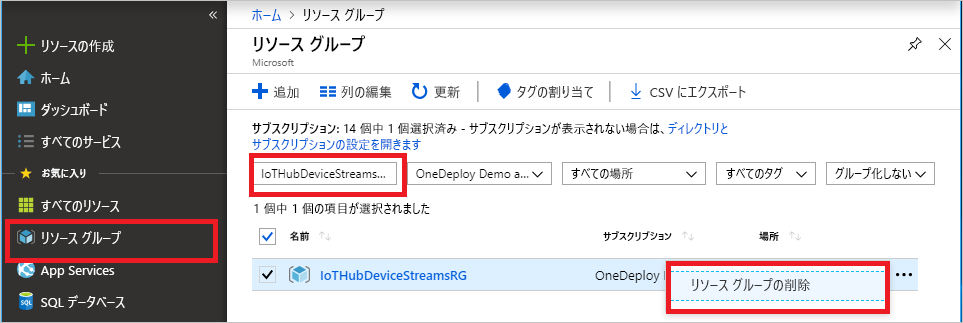

次の推奨記事に進む場合は、既に作成したリソースを維持して、再利用することができます。

それ以外の場合は、課金されないようにするために、この記事で作成した Azure リソースを削除してもかまいません。 

> [!IMPORTANT]
> リソース グループを削除すると、元に戻すことができません。 リソース グループとそこに含まれるすべてのリソースは完全に削除されます。 間違ったリソース グループやリソースをうっかり削除しないようにしてください。 IoT ハブを、保持したいリソースが含まれている既存のリソース グループ内に作成した場合は、リソース グループを削除するのではなく、IoT Hub リソースだけを削除してください。
>

名前でリソース グループを削除するには、以下の手順を実行します。

1. [Azure ポータル](https://portal.azure.com) にサインインし、 **[リソース グループ]** をクリックします。

2. **[名前でフィルター処理してください]** ボックスに、IoT ハブが含まれているリソース グループの名前を入力します。 

3. 結果一覧のでリソース グループの **[...]** をクリックし、**[リソース グループの削除]** をクリックします。

    

4. リソース グループの削除の確認を求めるメッセージが表示されます。 確認のためにリソース グループの名前を再度入力し、**[削除]** をクリックします。 しばらくすると、リソース グループとそこに含まれているすべてのリソースが削除されます。