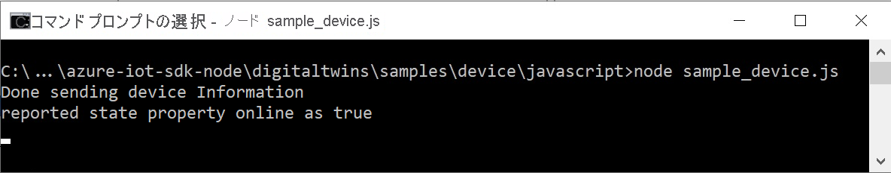

このクイックスタートでは、IoT プラグ アンド プレイ デバイス アプリケーションのサンプルをビルドし、それをご利用の IoT ハブに接続し、送信されるテレメトリを Azure IoT エクスプローラー ツールを使用して表示する方法を示します。 このサンプル アプリケーションは Node.js で記述されており、Node.js 用 Azure IoT device SDK に含まれています。 ソリューション ビルダーは Azure IoT エクスプローラー ツールを使用して、デバイス コードを表示しなくても IoT プラグ アンド プレイ デバイスの機能を理解することができます。

## <a name="prerequisites"></a>前提条件

[!INCLUDE [iot-pnp-prerequisites](iot-pnp-prerequisites.md)]

このクイックスタートを完了するには、開発用マシンに Node.js が必要です。 [nodejs.org](https://nodejs.org) から、複数のプラットフォームに対応した最新の推奨バージョンをダウンロードできます。

開発コンピューターに現在インストールされている Node.js のバージョンは、次のコマンドを使って確認できます。

```cmd/sh
node --version
```

## <a name="download-the-code"></a>コードのダウンロード

このクイックスタートでは、Node.js 用 Azure IoT Hub Device SDK をクローンしてビルドするために使用できる開発環境を準備します。

任意のディレクトリでコマンド プロンプトを開きます。 次のコマンドを実行して、[Node.js 用 Microsoft Azure IoT SDK](https://github.com/Azure/azure-iot-sdk-node) GitHub リポジトリをこの場所にクローンします。

```cmd/sh
git clone https://github.com/Azure/azure-iot-sdk-node
```

## <a name="install-required-libraries"></a>必要なライブラリをインストールする

デバイス SDK を使用して、含まれているサンプル コードをビルドします。 ビルドしたアプリケーションでは、IoT ハブに接続するデバイスのシミュレーションが行われます。 アプリケーションによりテレメトリとプロパティが送信され、コマンドが受け取られます。

1. ローカル ターミナル ウィンドウで、クローンしたリポジトリのフォルダーに移動し、 */azure-iot-sdk-node/device/samples/pnp* フォルダーに移動します。 次に、次のコマンドを実行して、必要なライブラリをインストールします。

    ```cmd/sh
    npm install
    ```

1. 先ほどメモしたデバイス接続文字列で、環境変数を構成します。

    ```cmd/sh
    set IOTHUB_DEVICE_CONNECTION_STRING=<YourDeviceConnectionString>
    ```

## <a name="run-the-sample-device"></a>サンプル デバイスを実行する

このサンプルにより、単純な IoT プラグ アンド プレイのサーモスタット デバイスが実装されます。 このサンプルにより実装されるモデルによって、IoT プラグ アンド プレイ [コンポーネント](../articles/iot-pnp/concepts-modeling-guide.md)は使用されません。 [サーモスタット デバイスの DTDL モデル ファイル](https://github.com/Azure/opendigitaltwins-dtdl/blob/master/DTDL/v2/samples/Thermostat.json)により、デバイスによって実装されるテレメトリ、プロパティ、およびコマンドが定義されます。

_simple_thermostat.js_ ファイルを開きます。 このファイルでは、以下の方法を確認できます。

1. 必要なインターフェイスをインポートする。
1. プロパティ更新ハンドラーとコマンド ハンドラーを記述する。
1. 必要なプロパティの修正プログラムを処理し、テレメトリを送信する。
1. 必要に応じて、Azure Device Provisioning Service (DPS) を使用して、デバイスをプロビジョニングする。

main 関数では、すべてがどのようにまとめられているかを確認できます。

1. 接続文字列からデバイスを作成するか、DPS を使用してデバイスをプロビジョニングします。
1. IoT プラグ アンド プレイのデバイス モデルを指定するには、**modelID** オプションを使用します。
1. コマンド ハンドラーを有効にします。
1. デバイスからハブにテレメトリを送信します。
1. デバイス ツインを取得し、レポートされたプロパティを更新します。
1. 必要なプロパティ更新ハンドラーを有効にします。

[!INCLUDE [iot-pnp-environment](iot-pnp-environment.md)]

サンプル構成の詳細については、[サンプルの readme](https://github.com/Azure/azure-iot-sdk-node/blob/master/device/samples/pnp/readme.md) を参照してください。

サンプル アプリケーションを実行して、IoT ハブにテレメトリを送信する IoT プラグ アンド プレイ デバイスをシミュレートします。 サンプル アプリケーションを実行するには、次のコマンドを使用します。

```cmd\sh
node simple_thermostat.js
```

次の出力が表示されます。これは、デバイスがハブへの利用統計情報の送信を開始し、コマンドとプロパティの更新情報を受信する準備ができたことを示します。



次の手順を完了するまで、サンプルを実行したままにしておきます。

## <a name="use-azure-iot-explorer-to-validate-the-code"></a>Azure IoT エクスプローラーを使用してコードを確認する

デバイス クライアントのサンプルが開始された後、Azure IoT エクスプローラー ツールを使用して、それが動作していることを確認します。

[!INCLUDE [iot-pnp-iot-explorer.md](iot-pnp-iot-explorer.md)]
