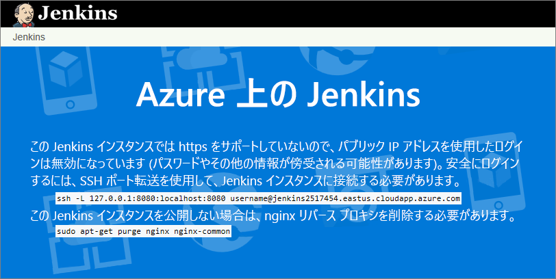
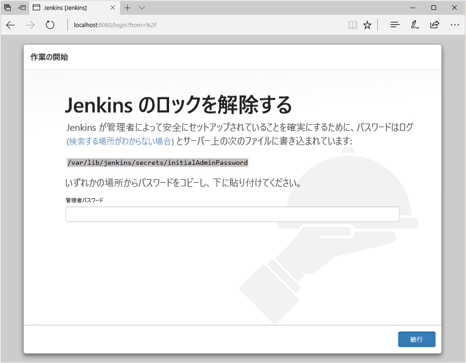
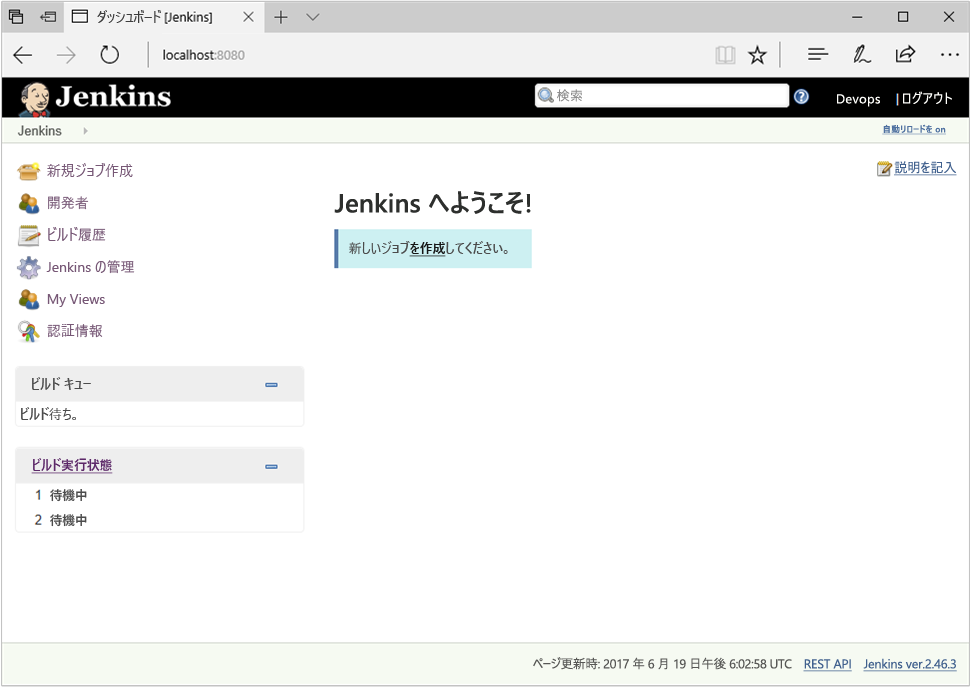
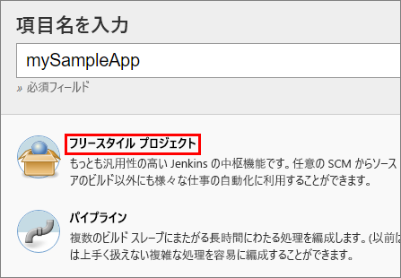
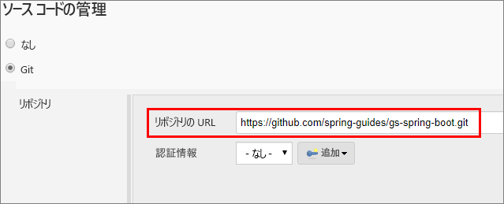
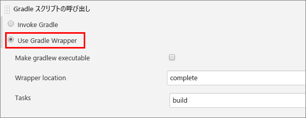
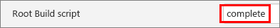
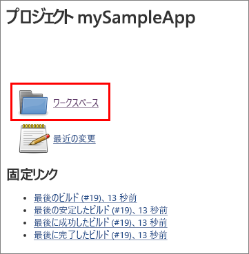

## <a name="prerequisites"></a>前提条件

* Azure サブスクリプション
* コンピューターのコマンド ラインでの SSH アクセス (Bash シェル、[PuTTY](https://www.putty.org/) など)

[!INCLUDE [quickstarts-free-trial-note](quickstarts-free-trial-note.md)]

## <a name="create-the-jenkins-vm-from-the-solution-template"></a>ソリューション テンプレートからの Jenkins VM の作成
Jenkins は、Jenkins サーバーが 1 つ以上のエージェントに作業を委任するモデルをサポートしているので、1 つの Jenkins インストールで多数のプロジェクトをホストすることや、ビルドやテストに必要なさまざまな環境を提供することができます。 このセクションの手順では、Azure に Jenkins サーバーをインストールして構成する方法を説明します。

[!INCLUDE [jenkins-install-from-azure-marketplace-image](jenkins-install-from-azure-marketplace-image.md)]

## <a name="connect-to-jenkins"></a>Jenkins に接続する

Web ブラウザーで仮想マシンに移動します (例: `http://jenkins2517454.eastus.cloudapp.azure.com/`)。 セキュリティで保護されていない HTTP 経由では Jenkins コンソールにアクセスできません。そのためこのページには、ご使用のコンピューターから SSH トンネルを使って安全に Jenkins コンソールにアクセスする手順が掲載されています。



このページのコマンド ラインから `ssh` コマンドを使用してトンネルを設定します。`username` は、先ほどソリューション テンプレートから仮想マシンをセットアップするときに選択した仮想マシンの管理者ユーザーの名前に置き換えてください。

```bash
ssh -L 127.0.0.1:8080:localhost:8080 jenkinsadmin@jenkins2517454.eastus.cloudapp.azure.com
```

トンネルを開始した後、ローカル コンピューターで `http://localhost:8080/` に移動します。 

Jenkins VM に SSH 接続している状態で、コマンド ラインから次のコマンドを実行して初期パスワードを取得します。

```bash
sudo cat /var/lib/jenkins/secrets/initialAdminPassword
```

初めて使うときは、この初期パスワードを使って Jenkins ダッシュボードのロックを解除します。



次のページの **[Install suggested plugins]\(推奨プラグインのインストール\)** を選択し、Jenkins ダッシュボードへのアクセスに使用した Jenkins 管理者ユーザーを作成します。



Jenkins サーバーでコードをビルドする準備が整いました。

## <a name="create-your-first-job"></a>最初のジョブの作成

Jenkins コンソールから **[Create new jobs]\(新しいジョブの作成\)** を選択して **mySampleApp** という名前を付け、 **[Freestyle project]\(フリースタイル プロジェクト\)** を選択して **[OK]** を選択します。

 

**[ソース コード管理]** タブを選択して **[Git]** を有効にし、 **[リポジトリの URL]** フィールドに次の URL を入力します。`https://github.com/spring-guides/gs-spring-boot.git`

 

**[ビルド]** タブを選択し、 **[ビルド ステップの追加]** 、 **[Invoke Gradle script]\(Gradle スクリプトの呼び出し\)** の順に選択します。 **[Use Gradle Wrapper]\(Gradle ラッパーの使用\)** を選択して、`complete`[Wrapper location]\(ラッパーの場所\) **に「** 」、`build`[タスク] **に「** 」と入力します。

 

**[詳細]** を選択し、`complete`[Root Build script]\(ルート ビルド スクリプト\)**フィールドに** と入力します。 **[保存]** を選択します。

 

## <a name="build-the-code"></a>コードのビルド

**[Build Now]\(今すぐビルド\)** を選択してコードをコンパイルし、サンプル アプリをパッケージします。 ビルドが完了したら、プロジェクトの **[ワークスペース]** リンクを選択します。

 

ビルドが成功したことを確かめるために、`complete/build/libs` に移動し、`gs-spring-boot-0.1.0.jar` が存在することを確認します。 Azure 上の Jenkins サーバーで独自のプロジェクトをビルドする準備が整いました。

## <a name="troubleshooting-the-jenkins-solution-template"></a>Jenkins ソリューション テンプレートのトラブルシューティング

Jenkins ソリューション テンプレートに関するバグを見つけた場合は、[Jenkins GitHub リポジトリ](https://github.com/azure/jenkins/issues)で問題を報告してください。

## <a name="next-steps"></a>次の手順

> [!div class="nextstepaction"]
> [Azure VM を Jenkins エージェントとして追加する](/azure/jenkins/jenkins-azure-vm-agents)