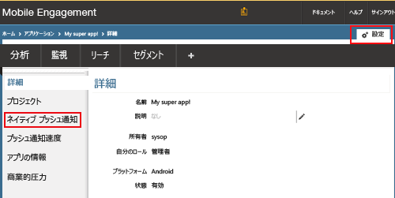
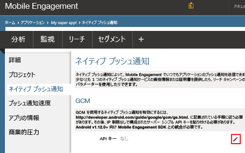
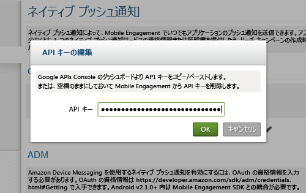
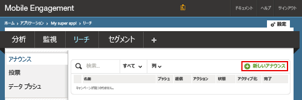
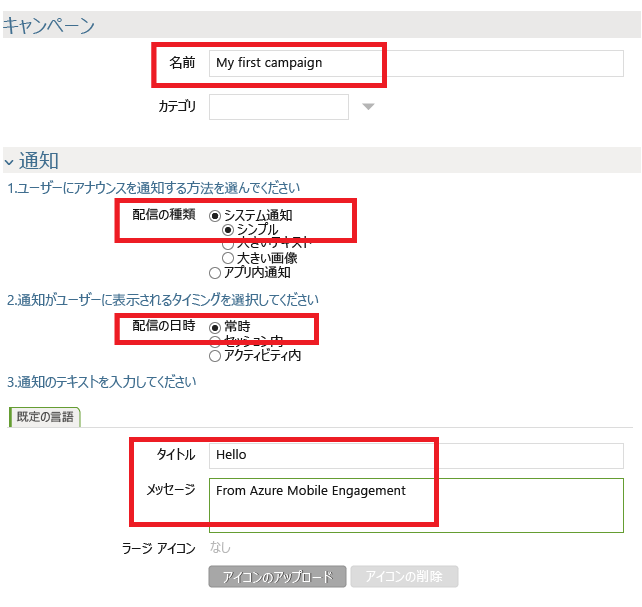
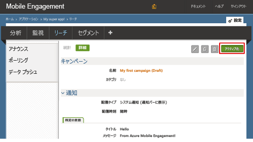

### Mobile Engagement に GCM API キーへのアクセス権限を付与する

Mobile Engagement にプッシュ通知の送信を許可するには、API キーへのアクセス権限を付与する必要があります。 これは、キーを構成して Mobile Engagement ポータルに入力することで実行します。

1. Azure Portal で、このプロジェクトに使用しているアプリを対象としていることを確認し、下部にある **[エンゲージ]** ボタンをクリックします。

    

2. ここで **[設定]**  ->  **[ネイティブ プッシュ通知]** セクションをクリックし、GCM キーを入力します。

    

3. 次に示す **[GCM 設定]** セクションの **[API キー]** の**編集**アイコンをクリックします。

    

4. ポップアップ画面で、前に取得した GCM サーバー キーを貼り付け、 **[OK]** をクリックします。

    

## アプリへ通知を送信する

アプリにプッシュ通知を送信する単純なプッシュ通知キャンペーンを作成します。

1. Mobile Engagement ポータルで **[リーチ]** タブに移動します。

2. **[新しいお知らせ]** をクリックして、プッシュ通知キャンペーンを作成します。

    
3. 次の手順に従って、キャンペーンの最初のフィールドを設定します。

    

    a.[サインオン URL] ボックスに、次のパターンを使用して、ユーザーが Pluralsight アプリケーションへのサインオンに使用する次の URL を入力します。 キャンペーンの名前を付けます。

    b. **[配信タイプ]** として *[システム通知] > [簡易]* を選択します。これは、タイトルと数行のテキストを表示する単純な Android のプッシュ通知です。

    c. **[配信時刻]** で *[指定なし]* を選択し、アプリが起動されているかどうかに関係なく、アプリが通知を受信できるようにします。

    d. 通知テキストに、プッシュ通知内で太字で表示される**タイトル**を入力します。

    e. 次に、**メッセージ**を入力します。
4. スクロール ダウンし、**[コンテンツ]** セクションで **[通知のみ]** を選択します。

    
5. 最も基本的なキャンペーンの設定が完了しました。 もう一度下にスクロールし、 **[作成]** ボタンをクリックしてキャンペーンを保存します。
6. 最後の手順として、 **[アクティブ化]** をクリックしてキャンペーンをアクティブにし、プッシュ通知を送信します。
   
    

