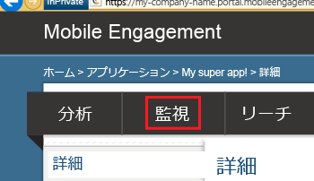

このセクションでは、Mobile Engagement のリアルタイム監視機能を使用して、アプリが Mobile Engagement のバックエンドに接続していることを確認する方法について説明します。

1. Mobile Engagement ポータルに移動します。このプロジェクト用に使用しているアプリを対象にしていることを確認し、下部にある **[エンゲージ]** ボタンをクリックします。

	 

2. Mobile Engagement ポータルに移動します。ここで **[監視]** タブをクリックします。
	 
	

3. モニターがアプリを起動するデバイスをリアルタイムで表示する準備が整いました。
	 
4. エミュレーター/シミュレーターまたは接続されたデバイスのいずれかでアプリを起動します。統合が適切に行われていれば、モニターには 1 つのセッションが表示されます。これは、アプリが Mobile Engagement バックエンドに接続され、バックエンドにデータを送信していることを意味します。
	
	 

<!---HONumber=Oct15_HO1-->