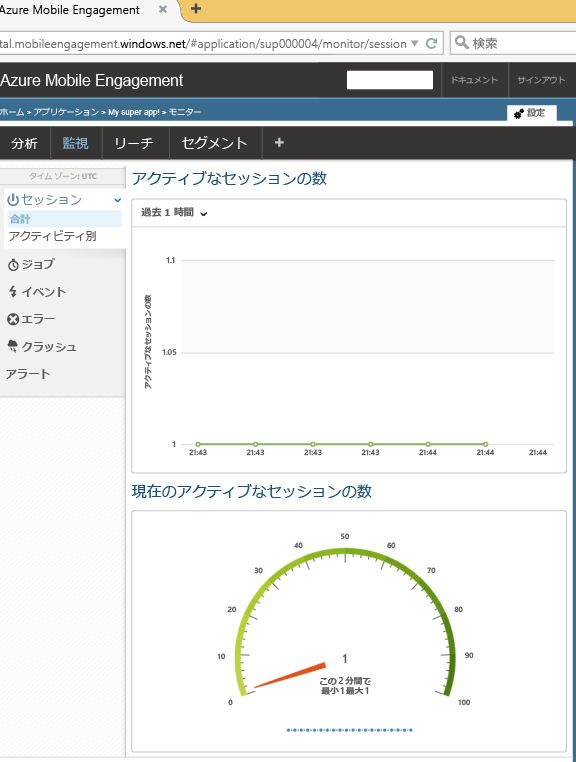

このセクションでは、Mobile Engagement のリアルタイム監視機能を使用して、アプリを Mobile Engagement バックエンドに接続する方法について説明します。 

1. **Azure Mobile Engagement** アカウントで、**Mobile Engagement** ポータルで監視および管理するアプリを選択していることを確認します。 下部にある **[エンゲージ]** ボタンをクリックして、Mobile Engagement ポータルに移動します。 
   
     
2. Mobile Engagement ポータルに移動します。 [監視] タブが選択されていない場合は、 **[監視]** をクリックします。
3. モニターがアプリを起動するデバイスをリアルタイムで表示する準備が整いました。
4. アプリを起動します。 統合が適切に行われていれば、モニターには 1 つのセッションが表示されます。これは、アプリが Mobile Engagement バックエンドに接続され、バックエンドにデータを送信していることを意味します。  
   
     

