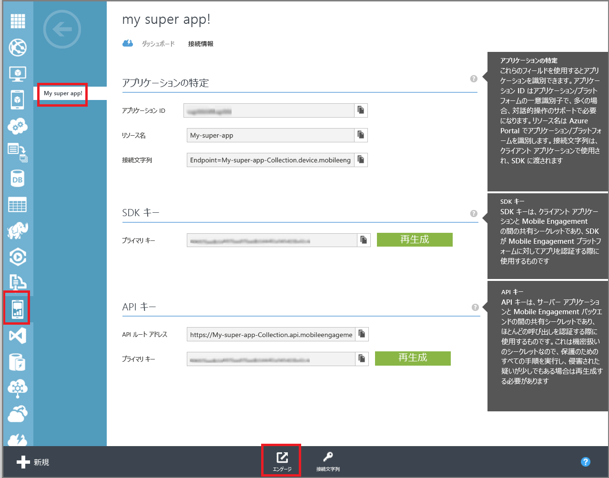

このセクションでは、Mobile Engagement のリアルタイム監視機能を使用して、Mobile Engagement バックエンドのアプリを接続する方法を示します。 

1. **Azure Mobile Engagement**アカウントを監視および管理するアプリを選択するかどうかを確認、 **Mobile Engagement**ポータル。 クリックして、Mobile Engagement ポータルに移動し、**の関心を引く**下部にあるボタンをクリックします。 
   
     
2. Mobile Engagement ポータルが入ります。 [監視] タブが選択されていない場合はクリックして、**モニター**です。
3. モニターは、アプリの開始がリアルタイムで任意のデバイスを表示する準備ができてです。
4. 今すぐアプリを開始します。 つまり、アプリが Mobile Engagement バックエンドに接続されてし、データを送信は、統合が正しい場合、モニターで 1 つのセッションが表示されます。  
   
     

