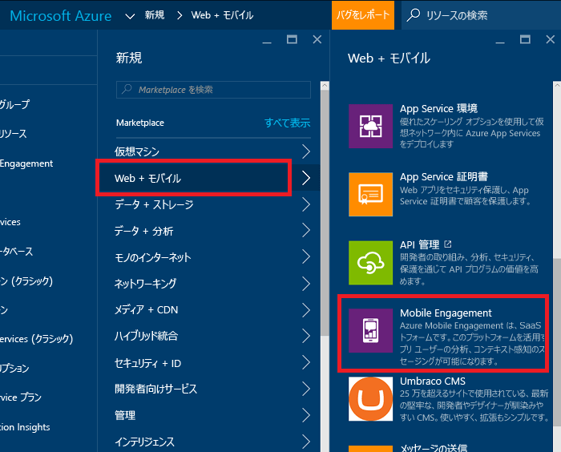
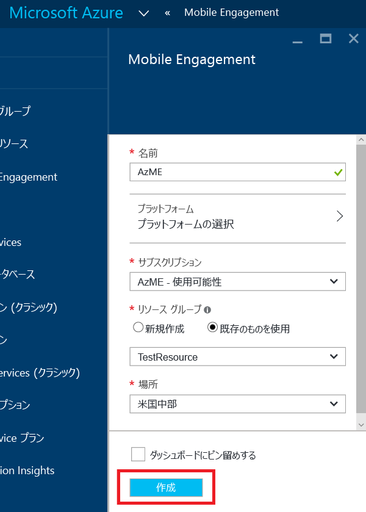
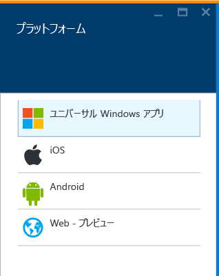
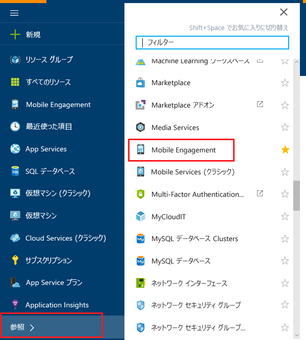
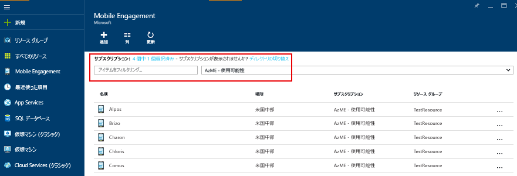
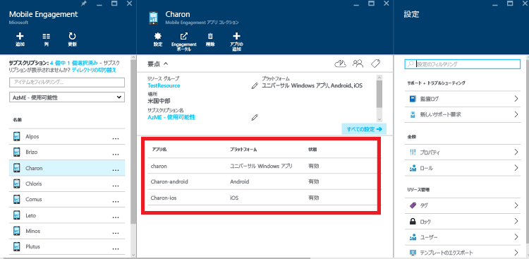
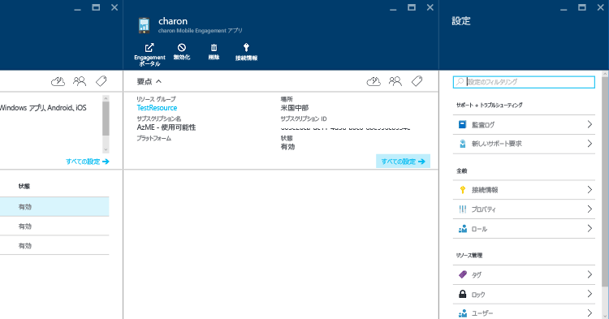

1. [Azure Portal](https://portal.azure.com) にログオンします。
2. **[新規]**、**[Web + モバイル]**、**[Mobile Engagement]** の順にクリックします。
   
    
3. 表示される **[New Mobile Engagement App Collection]\(新しい Mobile Engagement アプリ コレクション\)** ブレードで、アプリ コレクションを作成します。 次の情報を入力します。
   
    
   
   * **名前**: 名前 of your *アプリケーション コレクション* 
   * **プラットフォーム**: クリックすると開く [プラットフォーム] ブレードでアプリのターゲット プラットフォームを選択します。 例: アプリを iOS と Android の両方に対応させる場合は、両方のプラットフォームを選択すると、このアプリ コレクションの下に 2 つのアプリが作成されます。 
     
      
   * **サブスクリプション**: Azure サブスクリプションを選択します。 
   * **リソース グループ**: この Azure リソース (Mobile Engagement アプリ コレクション) を追加する Azure リソース グループを選択します。 新しいリソース グループを作成することもできます。  
   * **場所**: このアプリ コレクションとアプリについてのデータが格納されるリージョン。
4. **[参照]** をクリックし、"**Mobile Engagement**" を検索して Mobile Engagement アプリ コレクションを参照します。
   
    
5. Mobile Engagement アプリ コレクションの一覧が表示されるので、アプリ コレクションを作成した同じ Azure サブスクリプションがあることを確認します。
   
    
6. 前の手順で作成したアプリ コレクションをクリックして、アプリ コレクション リソースのブレードを開きます。ブレードには、このアプリ コレクション内に存在するさまざまなアプリが表示されます。 
   
    
7. 開発対象とするプラットフォーム向けに作成したアプリをクリックします。 
   
    
8. 上部の **[接続情報]** コマンド ボタンをクリックして [接続情報] ブレードを開き、そこに表示される接続文字列をコピーします。 
   
    

