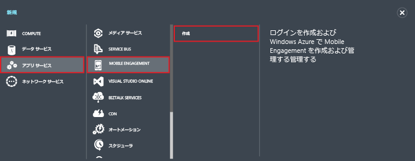
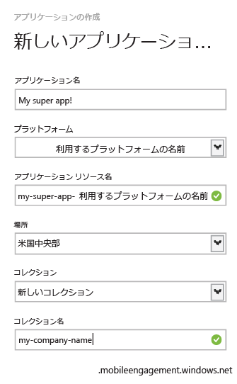

1. [Azure クラシック ポータル](https://manage.windowsazure.com)にログオンし、画面の下部にある **[+新規]** をクリックします。
2. **[App Services]**、**[Mobile Engagement]**、**[作成]** の順にクリックします。
   
       
3. 表示されたポップアップに、次の情報を入力します。
   
       
   
   * **アプリケーション名**: アプリケーションの名前。 
   * **プラットフォーム**: アプリのターゲット プラットフォーム。 モバイル アプリケーションのターゲットとするプラットフォームごとに 1 つの Mobile Engagement アプリを作成する必要があります。 
   * **アプリケーション リソース名**: このアプリケーションに API と URL を通じてアクセスするために使用する名前。 
   * **場所**: このアプリとアプリのコレクションがホストされるリージョン/データセンター。
   * **コレクション**: 以前に作成したコレクションか [新しいコレクション] を選択します。
   * **コレクション名**: アプリケーションのグループを表します。 すべてのアプリを 1 つのグループに含めることで、それらをメトリック集計できます。 該当する場合は、ここで会社名や部門を使用する必要があります。
4. **[アプリケーション]** タブで、作成したアプリを選択します。
5. **[接続情報]** をクリックして、モバイル アプリに統合する SDK に組み込む接続設定を表示します。
6. **[接続文字列]** をコピーします。これはアプリケーション コード内でこのアプリを識別し、アプリから Mobile Engagement に接続するために必要な情報です。
   
       

<!--HONumber=Jan17_HO3-->

