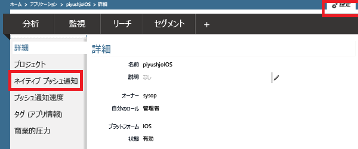
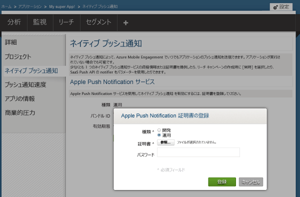
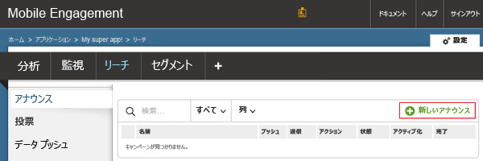
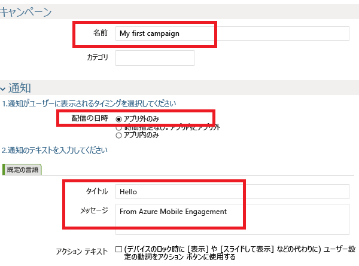
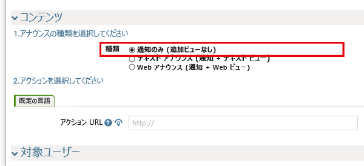
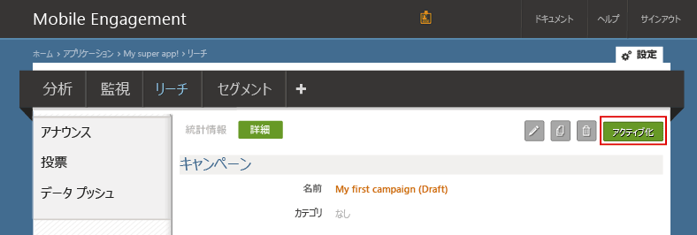
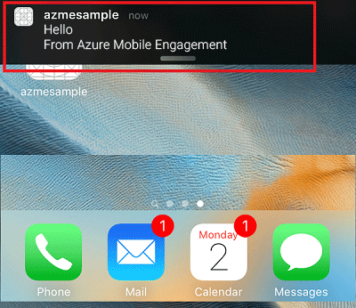
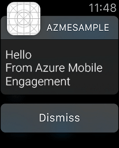

### Mobile Engagement にプッシュ証明書へのアクセスを許可する
Mobile Engagement がユーザーに代わりプッシュ通知を送信できるようにするには、Mobile Engagement に証明書へのアクセスを許可する必要があります。 このためには、証明書を Mobile Engagement ポータルに構成および入力します。 [Apple のドキュメント](https://developer.apple.com/library/prerelease/ios/documentation/IDEs/Conceptual/AppDistributionGuide/AddingCapabilities/AddingCapabilities.html#//apple_ref/doc/uid/TP40012582-CH26-SW6)

1. Mobile Engagement ポータルに移動します。 このプロジェクト用に使用しているアプリを対象にしていることを確認し、下部にある **[エンゲージ]** ボタンをクリックします。
   
    
2. Engagement ポータルで **[設定]** ページをクリックします。 このページで、p12 証明書をアップロードするために **[ネイティブ プッシュ通知]** セクションをクリックします。
   
    
3. p12 を選択してアップロードし、パスワードを入力します
   
    

## アプリへ通知を送信する
プッシュ通知をアプリに送る簡単なプッシュ通知キャンペーンを作成してみましょう。

1. Mobile Engagement ポータルで **[リーチ]** タブに移動します。
2. **[新しいお知らせ]** をクリックして、プッシュ キャンペーンを作成します。
   
    
3. キャンペーンの最初のフィールドを設定します
   
    
   
   * キャンペーンの **名前** を指定します。 
   * **[配信時刻]** として **[アプリ外のみ]** を選択します。これはテキストを扱う単純な種類の Apple プッシュ通知です。
   * 通知テキストとして、プッシュ通知の 1 行目になる **[タイトル]** を入力します。
   * 次に、2 行目になる **[メッセージ]** を入力します。
4. スクロール ダウンし、コンテンツ セクションで  **通知のみ**
   
    
5. 最も基本的なキャンペーンの設定が完了しました。 下にスクロールし、 **[作成]** ボタンをクリックしてプッシュ通知キャンペーンを保存します。 
6. 最後に、 **[アクティブ化]** をクリックしてプッシュ通知を送信します。 
   
    
7. 次のような通知センターの iOS デバイスで通知を受信することができます。
   
    
8. この iOS デバイスと組み合わせて使用する Apple Watch がある場合は、Apple Watch に通知が表示されます。
   
    

