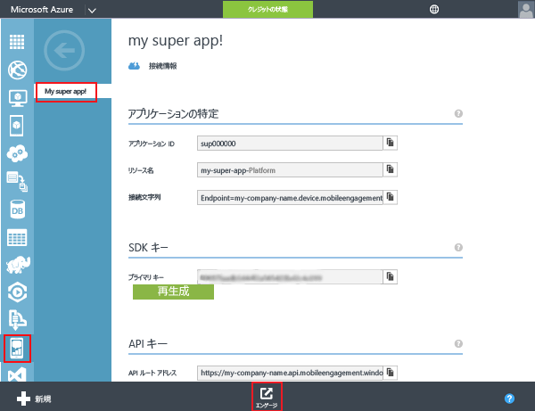

### Mobile Engagement にプッシュ証明書にアクセスを許可
Mobile Engagement を自動的にプッシュ通知を送信するには、証明書へのアクセスを付与する必要があります。 これは、Mobile Engagement ポータルに証明書を入力して、構成して行います。 説明したように、.p12 証明書を取得するかどうかを確認[Apple のドキュメント](https://developer.apple.com/library/prerelease/ios/documentation/IDEs/Conceptual/AppDistributionGuide/AddingCapabilities/AddingCapabilities.html#//apple_ref/doc/uid/TP40012582-CH26-SW6)

1. Mobile Engagement ポータルに移動します。 確認して、正しいにして、をクリックして、**の関心を引く**下部にあるボタンをクリックします。
   
    
2. をクリックして、**設定**Engagement ポータルのページです。 存在をクリックしてから、**ネイティブ プッシュ通知**p12 証明書をアップロードするセクション。
   
    
3. 選択、p12、アップロードおよびパスワードを入力します。
   
    

## アプリに通知を送信します。
アプリにプッシュを送信する単純なプッシュ通知キャンペーンを作成します。

1. 移動し、**到達** タブで、Mobile Engagement ポータル。
2. をクリックして**新しいお知らせ**プッシュ キャンペーンを作成するには
   
    
3. キャンペーンの最初のフィールドをセットアップするには。
   
    
   
   * 提供、**名前**キャンペーン用 
   * 選択、**配信時刻**として**アプリ外のみ**: これは、Apple プッシュ通知する単純型機能をいくつかのテキスト。
   * 通知のテキスト入力最初、**タイトル**最初の行にプッシュされます。
   * 入力し、**メッセージ**2 行目されます
4. スクロール ダウン、およびコンテンツ セクションの選択で**通知のみ**
   
    
5. 完了したら、最も基本的なキャンペーンを設定します。 今すぐ下にスクロールし、をクリックして**作成**プッシュ通知キャンペーンを保存するボタンをクリックします。 
6. 最後に、をクリックして**Activate**プッシュ通知を送信します。 
   
    
7. できます、次のような通知センターで iOS デバイスで通知を受信します。
   
    
8. この iOS デバイスとペアリング Apple Watch がある場合は、通知を Apple Watch で表示されます。
   
    

