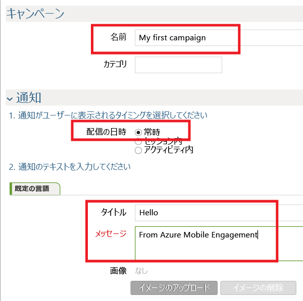
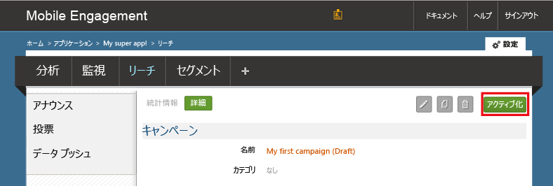

アプリにプッシュ通知を送信する単純なプッシュ通知キャンペーンを作成します。

1. 移動し、**到達** タブで、Mobile Engagement ポータル。
2. をクリックして**新しいお知らせ**プッシュ通知のキャンペーンを作成します。
   
    
3. 次の手順に従って、キャンペーンの最初のフィールドを設定します。
   
    
   
    」を参照します。 提供、**名前**キャンペーン用です。
   
    b. 選択**配信時刻**として*いつでも*です。
   
    d. 通知のテキストの入力、**タイトル**になる予定太字にプッシュします。
   
    e. 入力、**メッセージ**
4. スクロール ダウン、および、**コンテンツ**セクションで、**通知のみ**です。
   
    
5. 完了したら、最も基本的なキャンペーンを可能に設定します。 ここでもう一度下へスクロールし、クリックして、**作成**キャンペーンを保存するボタンをクリックします。
6. 最終ステップ: をクリックして**Activate**キャンペーンをアクティブ化して、プッシュ通知を送信します。
   
    

