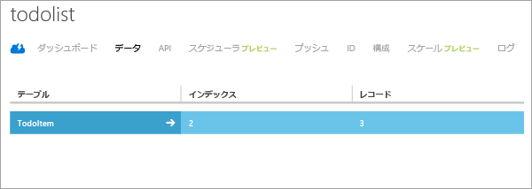

このチュートリアルの最後に、新しいアプリケーションをビルドして実行します。

1. 圧縮されたプロジェクト ファイルの保存場所を参照し、ファイルをコンピューター上の Android Studio プロジェクトのディレクトリに展開します。

2. Android Studio を起動します。プロジェクトを使用していて、それが表示された場合は、そのプロジェクトを閉じます ([ファイル] => [プロジェクトを閉じる])。

3. **[既存の Android Studio プロジェクトを開く]** を選択し、プロジェクトの場所を参照して、**[OK]** をクリックします。

 	

4. 左側の **[プロジェクト エクスプローラー]** ウィンドウで、*[プロジェクト]* タブが選択されていることを確認し、**[app]**、**[src]**、**[java]** の順に開いて、**[ToDoactivity]** をダブルクリックします。

   	

5. SDK のバージョン 2.0 をダウンロードした場合は、モバイル サービスの URL とキーを含むようにコードを更新する必要があります。
	- 	**TodoActivity.java** の **OnCreate** メソッド内で、Mobile Services クライアントをインスタンス化するコードを見つけます。前の図にこのコードが示されています。
	- 	"MobileServiceUrl" を、モバイル サービスの実際の URL に置き換えます。
	- 	"AppKey" を、モバイル サービスのキーに置き換えます。
	- 	詳細については、チュートリアル「[既存のアプリに Mobile Services を追加する](../articles/mobile-services/mobile-services-android-get-started-data.md)」を参照してください。 

6. **[Run]** メニューの **[Run]** をクリックして、Android エミュレーター内でプロジェクトを開始します。

	> [AZURE.IMPORTANT]プロジェクトを Android エミュレーターで実行するには、Android Virtual Device (AVD) を 1 つ以上定義する必要があります。これらのデバイスを作成および管理するには、AVD Manager を使用します。

7. アプリケーションで、意味のあるテキスト (たとえば、「_チュートリアルの完了_」) を入力し、**[Add]** をクリックします。

   	![][10]

   	これで、Azure でホストされている新しいモバイル サービスに POST 要求が送信されます。要求のデータは TodoItem テーブルに挿入されます。テーブルに格納された項目がモバイル サービスによって返され、データが一覧に表示されます。

	> [AZURE.NOTE]モバイル サービスにアクセスして ToDoActivity.java ファイルにあるデータを照会および挿入するコードを確認できます。

8. 管理ポータルに戻り、**[データ]** タブ、**TodoItems** テーブルの順にクリックします。

   	

   	これで、アプリケーションによってテーブルに挿入されたデータを参照できます。

   	

<!-- Images. -->
[0]: ./media/mobile-services-android-get-started/mobile-quickstart-completed-android.png
[6]: ./media/mobile-services-android-get-started/mobile-portal-quickstart-android.png
[7]: ./media/mobile-services-android-get-started/mobile-quickstart-steps-android.png
[8]: ./media/mobile-services-android-get-started/Android-Studio-quickstart.png
[10]: ./media/mobile-services-android-get-started/mobile-quickstart-startup-android.png
[11]: ./media/mobile-services-android-get-started/mobile-data-tab.png
[12]: ./media/mobile-services-android-get-started/mobile-data-browse.png
[14]: ./media/mobile-services-android-get-started/android-studio-import-project.png
[15]: ./media/mobile-services-android-get-started/mobile-services-import-android-project.png

<!-- URLs. -->
[Add Mobile Services to an existing app]: ../articles/mobile-services/mobile-services-android-get-started-data.md
[Get started with authentication]: ../articles/mobile-services/mobile-services-android-get-started-users.md
[Get started with push notifications]: ../articles/mobile-services/mobile-services-javascript-backend-android-get-started-push.md
[Android SDK]: https://go.microsoft.com/fwLink/p/?LinkID=280125
[Android Studio]: https://developer.android.com/sdk/index.html
[Mobile Services Android SDK]: https://go.microsoft.com/fwLink/p/?LinkID=266533

[Management Portal]: https://manage.windowsazure.com/

<!---HONumber=August15_HO6-->