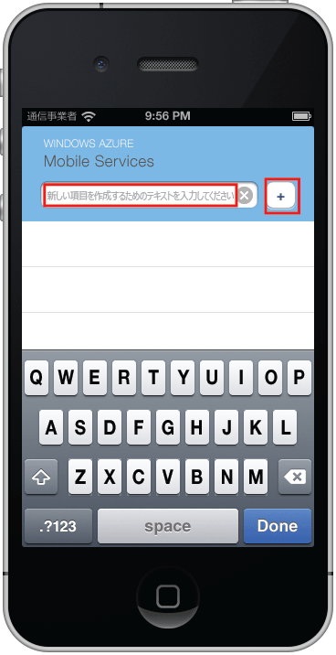

このチュートリアルの最後に、新しいアプリケーションをビルドして実行します。

1. 圧縮されたプロジェクト ファイルの保存場所を参照し、ファイルをコンピューター上に展開して、Xcode でプロジェクト ファイルを開きます。

2. **[実行]** ボタンを押してプロジェクトをビルドし、iPhone エミュレーターでアプリケーションを起動します。

3. アプリケーションで、意味のあるテキスト (たとえば、_「チュートリアルの完了」_) を入力し、プラス (**+**) アイコンをクリックします。

   	

   	これで、Azure でホストされている新しい Mobile Services に POST 要求が送信されます。要求のデータは TodoItem テーブルに挿入されます。テーブルに格納された項目が Mobile Services によって返され、データが一覧に表示されます。

 	

<!--HONumber=52--> 
