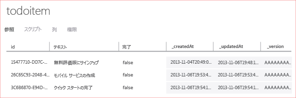

このチュートリアルの最後に、新しいアプリケーションをビルドして実行します。

1. 圧縮されたプロジェクト ファイルの保存場所を参照し、ファイルをコンピューター上に展開して、Visual Studio でソリューション ファイルを開きます。

2. **F5** キーを押してプロジェクトをリビルドし、アプリケーションを開始します。

3. アプリケーションで、**[Insert a TodoItem]** ボックスに意味のあるテキスト (たとえば、「 *Complete the tutorial*」) を入力し、**[Save]** をクリックします。

   	これで、Azure でホストされている新しい Mobile Services に POST 要求が送信されます。要求のデータは TodoItem テーブルに挿入されます。テーブルに格納された項目は Mobile Services によって返され、データはアプリケーションの 2 番目の列に表示されます。

4. (オプション) 汎用的な Windows ソリューションで、既定のスタートアップ プロジェクトをもう 1 つのアプリケーションに変更し、そのアプリケーションをもう一度実行します。

	アプリケーションが開始すると、前の手順で保存したデータが、Mobile Services から読み込まれる点に注目してください。
 
4. 管理ポータルに戻り、**[データ]** タブ、**TodoItems** テーブルの順にクリックします。

   	これで、アプリケーションによってテーブルに挿入されたデータを参照できます。

   	

<!--HONumber=52--> 
