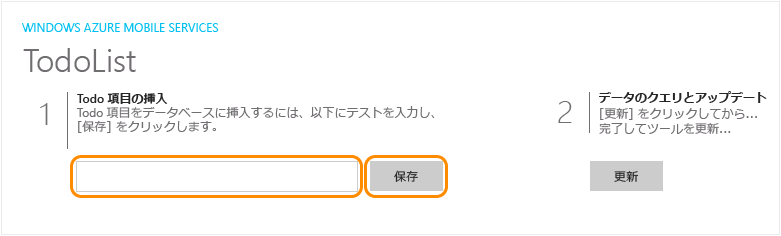


1. F5 キーを押してプロジェクトをリビルドし、Windows ストア アプリを開始します。

2. アプリケーションで、**[Insert a TodoItem]** ボックスに意味のあるテキスト (たとえば、「 *Complete the tutorial*」) を入力し、**[Save]** をクリックします。

	

	これで、Azure でホストされている新しいモバイル サービスに POST 要求が送信されます。

3. デバッグを停止して、ユニバーサル Windows ソリューションにある既定のスタートアップ プロジェクトを Windows Phone ストア アプリに変更し、もう一度 F5 キーを押します。

	
	
	アプリケーションが開始すると、前の手順で保存したデータが、モバイル サービスから読み込まれる点に注目してください。<!--HONumber=42-->
