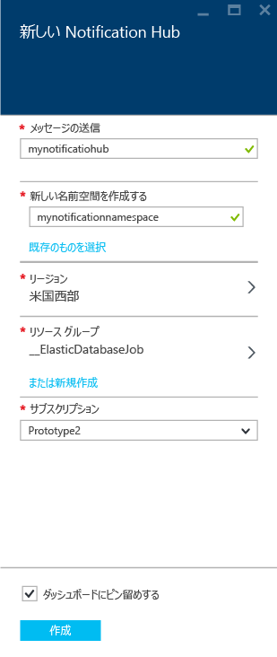
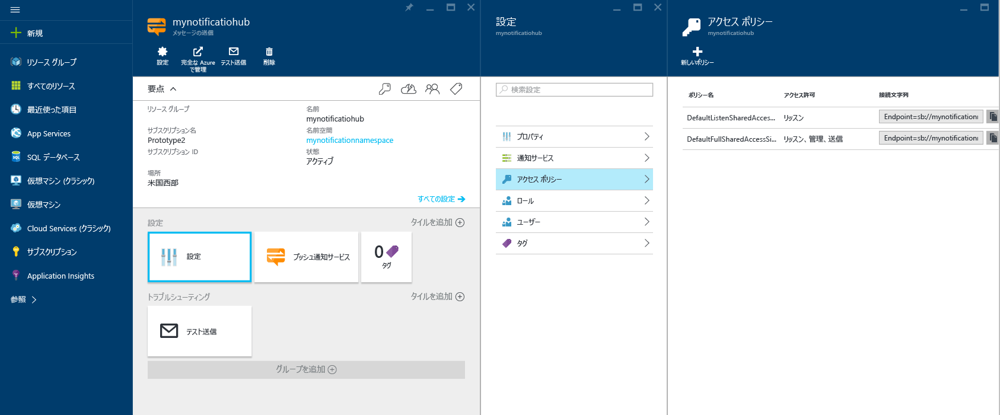

1. [Azure portal](https://portal.azure.com) にサインインする

1. 左側のメニューで **[すべてのサービス]** を選択し、 **[モバイル]** セクションの **[Notification Hubs]** を選択します。 サービス名の横にある星のアイコンを選択して、左側のメニューにある **[お気に入り]** セクションにサービスを追加します。 **Notification Hubs** を **[お気に入り]** に追加した後、左側のメニューでそれを選択します。

      

1. **[Notification Hubs]** ページで、ツール バーの **[追加]** を選択します。

      ![Notification Hubs - [追加] ツール バー ボタン](./media/notification-hubs-portal-create-new-hub/add-toolbar-button.png)

1. **[Notification Hub]** ページで、次の手順のようにします。

    1. **[通知ハブ]** に名前を入力します。  

    1. **[新しい名前空間の作成]** に名前を入力します。 名前空間には、少なくとも 1 つのハブが存在します。

    1. **[場所]** ドロップダウン リスト ボックスで値を選択します。 この値には、ハブを作成する場所を指定します。

    1. **[リソース グループ]** で既存のリソース グループを選択します。または、新しいリソース グループに名前を作成します。

    1. **作成** を選択します。

        

1. **[通知]** (ベルのアイコン) を選択し、 **[リソースに移動]** を選択します。 **[Notification Hubs]** ページの一覧を最新の情報に更新して、お使いの通知ハブを選択することもできます。

      ![Azure Portal > [通知] > [リソースに移動]](./media/notification-hubs-portal-create-new-hub/go-to-notification-hub.png)

1. リストから **[アクセス ポリシー]** を選択します。 使用可能な 2 つの接続文字列を書き留めてください。 これらは、後でプッシュ通知を処理するために必要になります。

      >[!IMPORTANT]
      >*DefaultFullSharedAccessSignature* ポリシーはアプリケーションで使用 "**しない**" でください。 これの使用が意図されているのはバックエンドだけです。
      >

      
