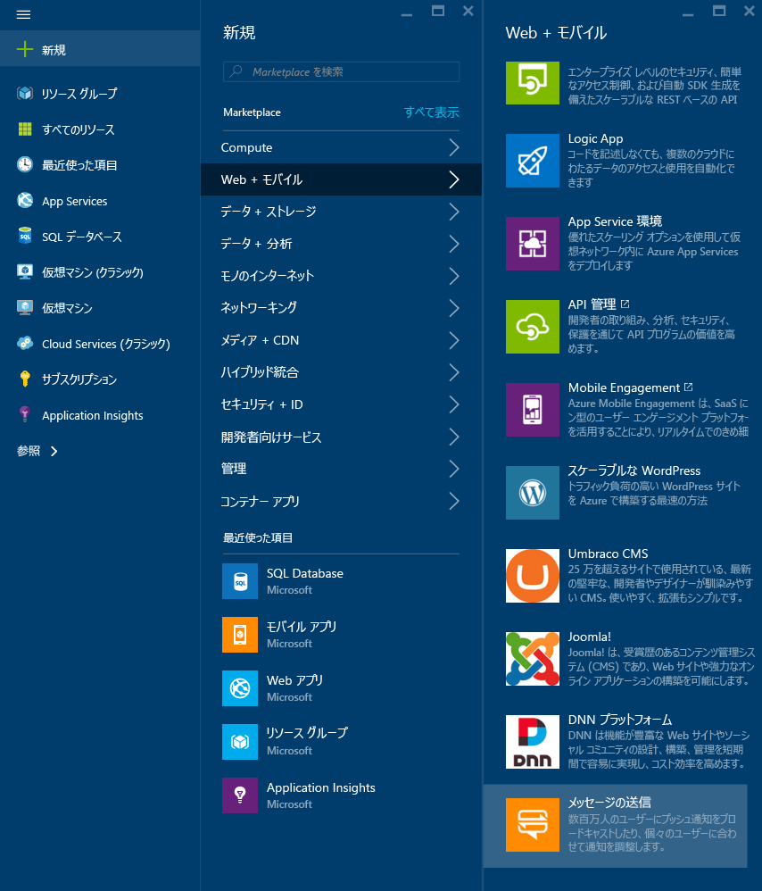
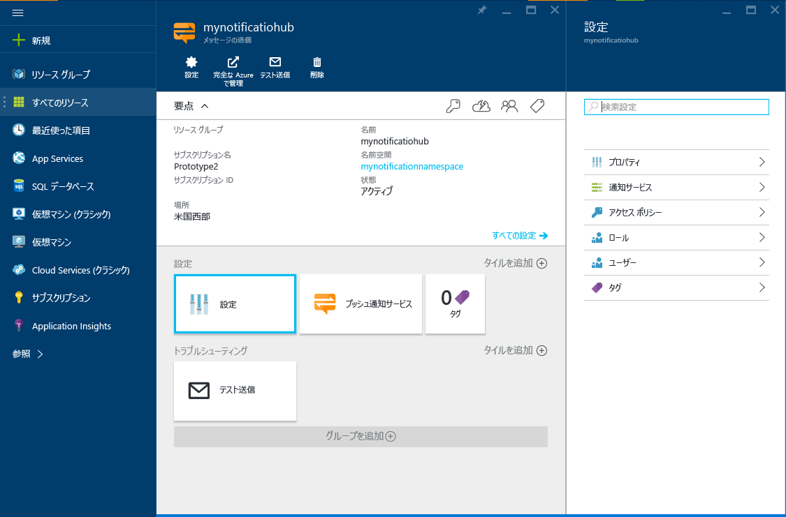

1. [Azure ポータル](https://portal.azure.com)にログインし、画面の右上にある **[+新規]** をクリックします。
2. **[新規]** をクリックし、**[Web + モバイル]** をクリックします。 必要に応じて下にスクロールし、 **[通知ハブ]**をクリックします。
   
      
      
3. **[通知ハブ]** フィールドには必ず一意の名前を指定します。 目的の**リージョン**、**サブスクリプション**、および**リソース グループ**を選択します (既にある場合)。 
   
    ハブを作成する Service Bus 名前空間を既に用意している場合、**[名前空間]** フィールドの **[既存項目の選択]** オプションでそれを選択します。  Service Bus 名前空間がない場合、ハブ名に基づいて作成される既定の名前を利用できます。 
   
    準備ができたら、 **[作成]**をクリックします。
   
      
4. 名前空間と通知ハブが作成されたら、それぞれのポータル ページに移動します。 
   
      
5. **[設定]** をクリックし、**[アクセス ポリシー]** をクリックします。2 つの接続文字列をメモします。これは後でプッシュ通知を処理する際に必要になります。
   
      

