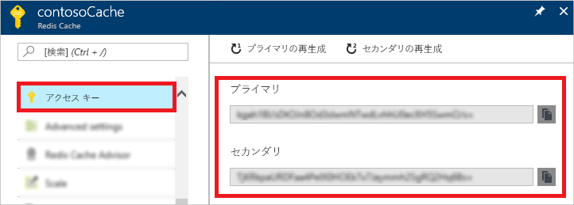
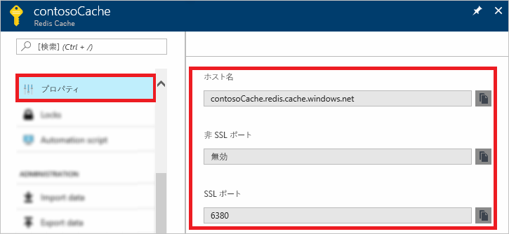

### Azure portal を使用して、ホスト名、ポート、およびアクセス キーを取得する

Azure Redis Cache のインスタンスに接続するときには、キャッシュ クライアントにキャッシュのホスト名、ポート、およびキーが必要です。 クライアントによっては、これらの項目を参照するための名前が若干異なる場合があります。 この情報は、Azure Portal で取得できます。

#### アクセス キーおよびホスト名を取得するには

1. [Azure portal](https://portal.azure.com) を使用してアクセス キーを取得するには、キャッシュを参照して、**[アクセス キー]** を選択します。 

    

2. ホスト名とポートを取得するには、**[プロパティ]** を選択します。

    

