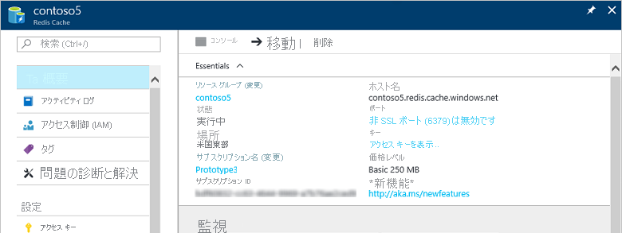

キャッシュには、[Azure ポータル](https://portal.azure.com)で **[参照]** ブレードを使用してアクセスできます。

キャッシュを表示するには、**[その他のサービス] > [Redis Caches]** をクリックします。最近 Redis Cache を参照した場合は、**[その他のサービス]** をクリックしなくても一覧から **[Redis Cache]** を直接クリックできます。

キャッシュのプロパティを表示するには、目的のキャッシュを選択します。

**[設定]** または **[すべての設定]** をクリックしてキャッシュを表示し、構成します。

<!---HONumber=AcomDC_0921_2016-->