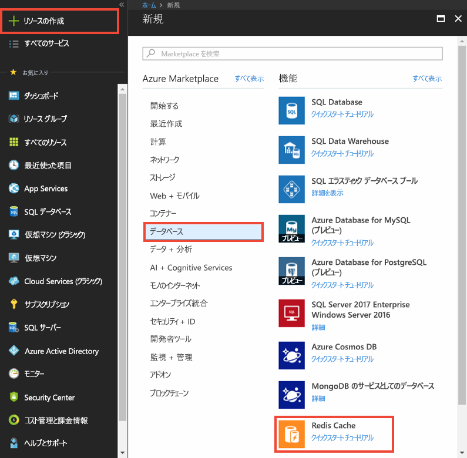
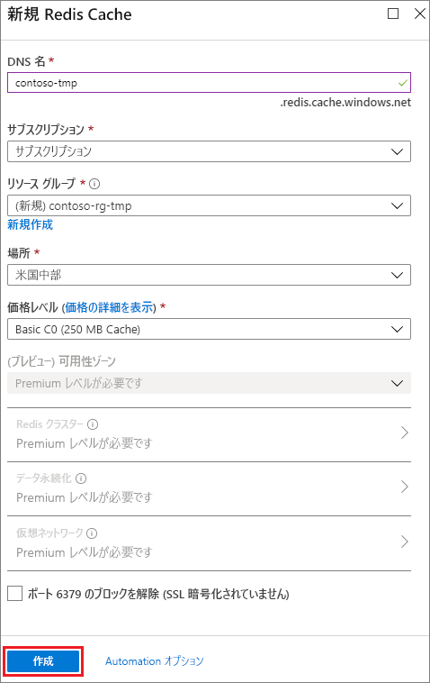
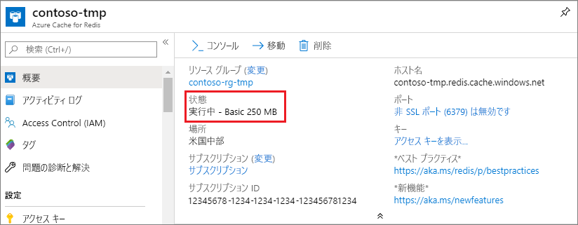

キャッシュを作成するには、まず [Azure Portal](https://portal.azure.com) にサインインし、**[新規]** > **[データベース]** > **[Redis Cache]** の順にクリックします。

> [!NOTE]
> Azure アカウントがない場合は、数分あれば [Azure アカウントを無料で作成](https://azure.microsoft.com/pricing/free-trial/?WT.mc_id=redis_cache_hero) することができます。
> 
> 

> [!NOTE]
> キャッシュは、Azure ポータルだけでなく、Resource Manager テンプレート、PowerShell、または Azure CLI を使用して作成することもできます。
> 
> * Resource Manager テンプレートを使用してキャッシュを作成する方法については、「 [テンプレートを使用して Redis Cache を作成する](../articles/redis-cache/cache-redis-cache-arm-provision.md)」をご覧ください。
> * Azure PowerShell を使用してキャッシュを作成する方法については、「 [Azure PowerShell を使用した Azure Redis Cache の管理](../articles/redis-cache/cache-howto-manage-redis-cache-powershell.md)」をご覧ください。
> * Azure CLI を使用してキャッシュを作成する方法については、「 [Azure コマンド ライン インターフェイス (Azure CLI) を使用して Azure Redis Cache を作成および管理する方法](../articles/redis-cache/cache-manage-cli.md)」を参照してください。
> 
> 

**[Redis Cache の新規作成]** ブレードで、必要なキャッシュ構成を指定します。

 

* キャッシュ エンドポイントに使用する一意のキャッシュ名を **[DNS 名]** に入力します。 キャッシュ名は 1 ～ 63 文字の文字列で、数字、英字、`-` 文字のみを使用する必要があります。 キャッシュ名の先頭と末尾には `-` 文字を使用できません。また、連続する `-` 文字は無効です。
* **[サブスクリプション]**で、キャッシュに使用する Azure サブスクリプションを選択します。 アカウントにサブスクリプションが&1; つしかない場合は自動的に選択されるため、 **[サブスクリプション]** ドロップダウン リストは表示されません。
* **[リソース グループ]**で、キャッシュのリソース グループを選択または作成します。 詳細については、[リソース グループを使用した Azure リソースの管理](../articles/azure-resource-manager/resource-group-overview.md)に関するページを参照してください。 
* **[場所]** を使用して、キャッシュのホストの地理的位置を指定します。 パフォーマンスを最大限に引き出すために、キャッシュは、キャッシュ クライアント アプリケーションと同じリージョンに作成することを強くお勧めします。
* **[価格レベル]** を使用して、必要なキャッシュ サイズと機能を選択します。
* **Redis クラスター** では、53 GB を超えるキャッシュを作成でき、複数の Redis ノード間でデータを共有することもできます。 詳細については、「 [Premium Azure Redis Cache のクラスタリングの構成方法](../articles/redis-cache/cache-how-to-premium-clustering.md)」を参照してください。
* **Redis の永続化** を使用して、Azure ストレージ アカウントにキャッシュを保持できます。 永続化の構成手順については、「 [Premium Azure Redis Cache の永続性の構成方法](../articles/redis-cache/cache-how-to-premium-persistence.md)」を参照してください。
* **Virtual Network** では、指定された Azure Virtual Network 内にあるクライアントのみにキャッシュへのアクセス権を制限することで、セキュリティと分離が強化されます。 サブネット、アクセス制御ポリシー、およびその他の Redis へのアクセスをさらに制限する機能を始め、VNet のすべての機能を使用できます。 詳細については、「 [Premium Azure Redis Cache の Virtual Network のサポートを構成する方法](../articles/redis-cache/cache-how-to-premium-vnet.md)」を参照してください。
* 新しいキャッシュでは、SSL を使用しないアクセスが既定で無効になっています。 非 SSL ポートを有効にするには、**[ポート 6379 のブロックを解除 (SSL 暗号化されていません)]** をオンにします。

新しいキャッシュ オプションを構成したら、 **[作成]**をクリックします。 キャッシュが作成されるまで数分かかる場合があります。 状態を確認するには、スタート画面で進行状況を監視してください。 キャッシュが作成されると、新しいキャッシュの状態が **実行中** になって、 [既定の設定](../articles/redis-cache/cache-configure.md#default-redis-server-configuration)で使用できるようになります。

<!--HONumber=Feb17_HO2-->

