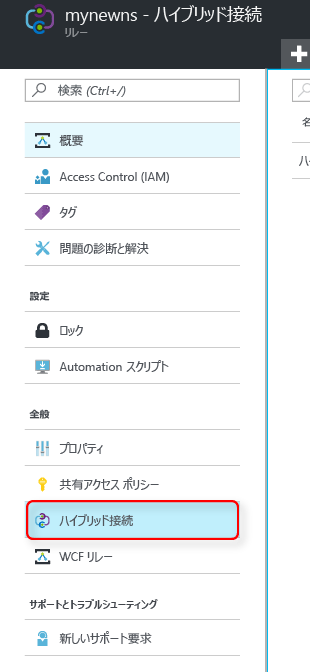
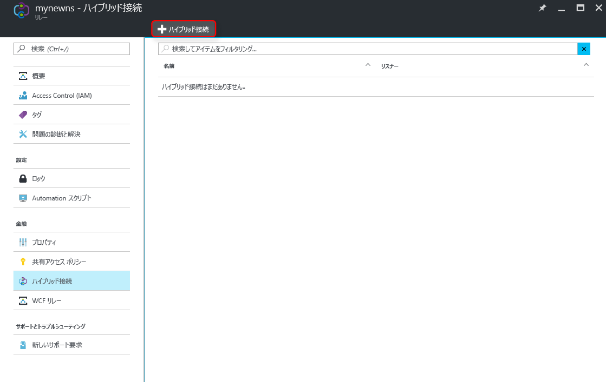
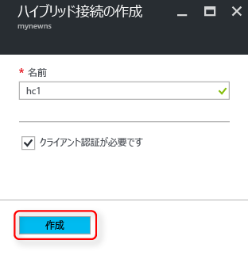

[こちらのページ][namespace-how-to]に従って、既に Relay 名前空間を作成していることを確認してください。

1. [Azure Portal](https://portal.azure.com) にログオンします。
2. Portal の左のナビゲーション ウィンドウで、**[すべてのリソース]** をクリックします。
3. ハイブリッド接続を作成する名前空間をクリックします。 この例では **mynewns** です。
   
4. **リレー名前空間**ブレードの **[ハイブリッド接続]** をクリックします。

    

5. 名前空間の概要ウィンドウで **[+ ハイブリッド接続]** をクリックします。
   
    
5. **[ハイブリッド接続の名前]** に入力し、他の値は既定値のままにします。
   
    
6. ダイアログの下部にある **[作成]** をクリックします。

[namespace-how-to]: ../articles/service-bus-relay/relay-create-namespace-portal.md 