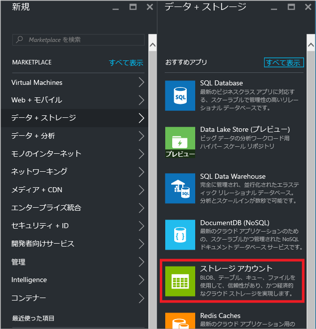
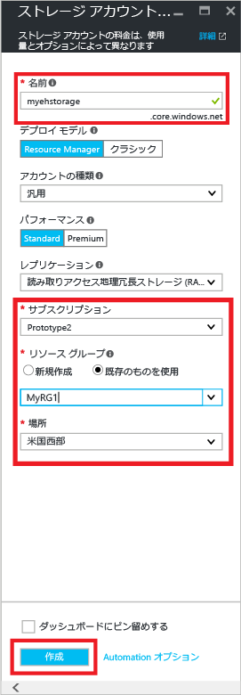
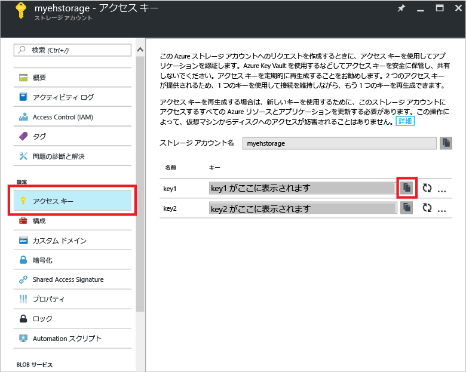
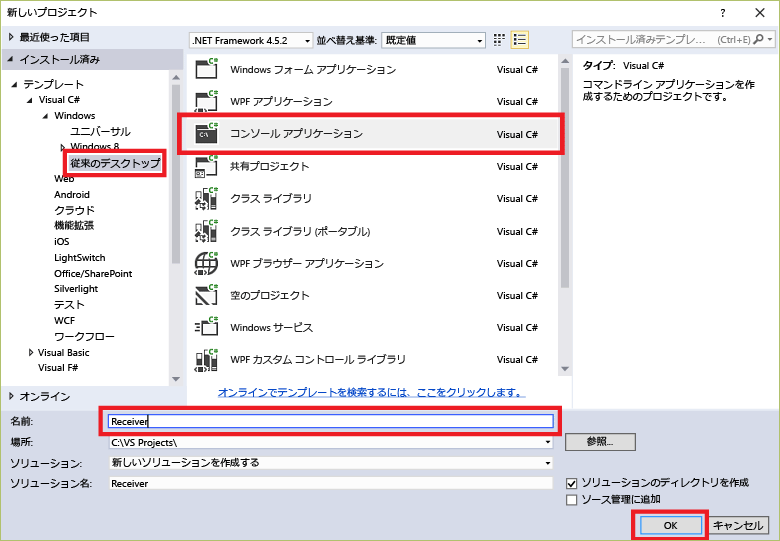
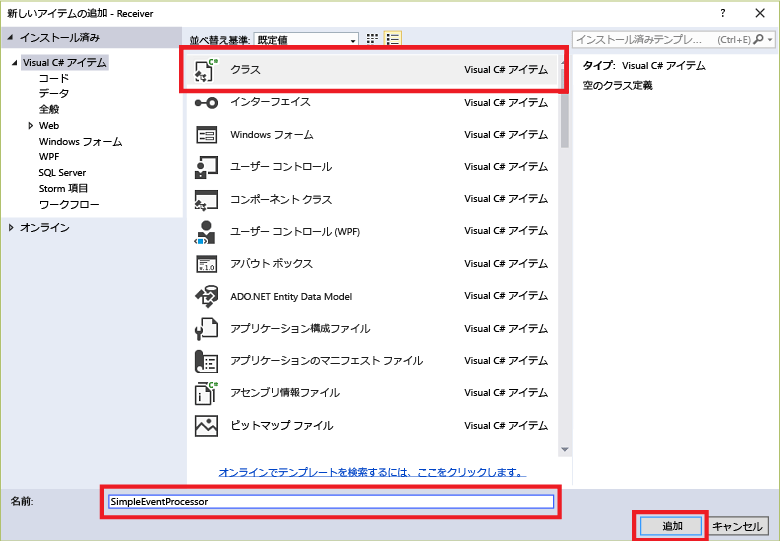

## EventProcessorHost を使用したメッセージの受信

[EventProcessorHost][] は、永続的なチェックポイントの管理によって Event Hubs のイベントの受信を簡素化し、並列してそれらの Event Hubs から受信する .NET クラスです。[EventProcessorHost][] を使用すると、さまざまなノードでホストされている場合でも、複数の受信側間でイベントを分割することができます。この例では、受信側が単一の場合に [EventProcessorHost][] を使用する方法を示します。[[イベント処理のスケールアウトのサンプル]][]は、受信側が複数の場合に [EventProcessorHost][] を使用する方法を示します。

[EventProcessorHost][] を使用するには [Azure ストレージ アカウント][]が必要です。

1. [Azure Portal][] にログインし、画面の左上にある **[新規]** をクリックします。

2. **[データ + ストレージ]**、**[ストレージ アカウント]** の順にクリックします。

    

3. **[ストレージ アカウントの作成]** ブレードで、ストレージ アカウントの名前を入力します。リソースが作成される Azure サブスクリプション、リソース グループ、場所を選択します。**[Create]** をクリックします。

    

4. ストレージ アカウントの一覧で、新しく作成したストレージ アカウントをクリックします。

5. ストレージ アカウントのブレードで、**[アクセス キー]** をクリックします。後でこのチュートリアルで使用するため、**key1** の値をコピーしておきます。

	

4. Visual Studio で、**コンソール アプリケーション** プロジェクト テンプレートを使用して、新しい Visual C# のデスクトップ アプリ プロジェクトを作成します。プロジェクトの名前として「**Receiver**」と入力します。

    

5. ソリューション エクスプローラーでソリューションを右クリックし、**[ソリューションの NuGet パッケージの管理]** をクリックします。

6. **[参照]** タブをクリックして、`Microsoft Azure Service Bus Event Hub - EventProcessorHost` を検索します。プロジェクト名 (**Receiver**) が **[バージョン]** ボックスで指定されていることを確認します。**[インストール]** をクリックして、使用条件に同意します。

    

	Visual Studio によって、[Azure Service Bus Event Hub - EventProcessorHost NuGet パッケージ](https://www.nuget.org/packages/Microsoft.Azure.ServiceBus.EventProcessorHost)への参照がすべての依存関係と共にダウンロード、インストール、追加されます。

7. **[Receiver]** プロジェクトを右クリックし、**[追加]**、**[クラス]** の順にクリックします。クラスの名前として「**SimpleEventProcessor**」と入力し、**[追加]** をクリックしてクラスを作成します。

	

8. SimpleEventProcessor.cs ファイルの先頭に次のステートメントを追加します。

	```
	using Microsoft.ServiceBus.Messaging;
	using System.Diagnostics;
	```

	次に、クラスの本文に次のコードを置き換えます。

	```
    class SimpleEventProcessor : IEventProcessor
	{
	    Stopwatch checkpointStopWatch;

	    async Task IEventProcessor.CloseAsync(PartitionContext context, CloseReason reason)
	    {
	        Console.WriteLine("Processor Shutting Down. Partition '{0}', Reason: '{1}'.", context.Lease.PartitionId, reason);
	        if (reason == CloseReason.Shutdown)
	        {
	            await context.CheckpointAsync();
	        }
	    }

	    Task IEventProcessor.OpenAsync(PartitionContext context)
	    {
	        Console.WriteLine("SimpleEventProcessor initialized.  Partition: '{0}', Offset: '{1}'", context.Lease.PartitionId, context.Lease.Offset);
	        this.checkpointStopWatch = new Stopwatch();
	        this.checkpointStopWatch.Start();
	        return Task.FromResult<object>(null);
	    }

	    async Task IEventProcessor.ProcessEventsAsync(PartitionContext context, IEnumerable<EventData> messages)
	    {
	        foreach (EventData eventData in messages)
	        {
	            string data = Encoding.UTF8.GetString(eventData.GetBytes());

	            Console.WriteLine(string.Format("Message received.  Partition: '{0}', Data: '{1}'",
	                context.Lease.PartitionId, data));
	        }

	        //Call checkpoint every 5 minutes, so that worker can resume processing from 5 minutes back if it restarts.
	        if (this.checkpointStopWatch.Elapsed > TimeSpan.FromMinutes(5))
            {
                await context.CheckpointAsync();
                this.checkpointStopWatch.Restart();
            }
	    }
	}
    ```

	このクラスは、**EventProcessorHost** から呼び出されて、Event Hub から受信したイベントを処理します。`SimpleEventProcessor` クラスは、ストップウォッチを使用して **EventProcessorHost** コンテキストで定期的にチェックポイント メソッドを呼び出します。これにより、受信側を再起動すると、処理の作業の 5 分以内に機能が失われます。

9. **Program** クラスで、 ファイルの先頭に次の `using` ステートメントを追加します。

	```
	using Microsoft.ServiceBus.Messaging;
	```

	次に、`Program` クラスの `Main` メソッドを次のコードに置き換え、先ほど保存した Event Hub の名前と名前空間レベルの接続文字列、および前のセクションでコピーしたストレージ アカウントとキーを代入します。

    ```
	static void Main(string[] args)
    {
      string eventHubConnectionString = "{Event Hub connection string}";
      string eventHubName = "{Event Hub name}";
      string storageAccountName = "{storage account name}";
      string storageAccountKey = "{storage account key}";
      string storageConnectionString = string.Format("DefaultEndpointsProtocol=https;AccountName={0};AccountKey={1}", storageAccountName, storageAccountKey);

      string eventProcessorHostName = Guid.NewGuid().ToString();
      EventProcessorHost eventProcessorHost = new EventProcessorHost(eventProcessorHostName, eventHubName, EventHubConsumerGroup.DefaultGroupName, eventHubConnectionString, storageConnectionString);
      Console.WriteLine("Registering EventProcessor...");
      var options = new EventProcessorOptions();
      options.ExceptionReceived += (sender, e) => { Console.WriteLine(e.Exception); };
      eventProcessorHost.RegisterEventProcessorAsync<SimpleEventProcessor>(options).Wait();

      Console.WriteLine("Receiving. Press enter key to stop worker.");
      Console.ReadLine();
      eventProcessorHost.UnregisterEventProcessorAsync().Wait();
    }
	```

> [AZURE.NOTE] このチュートリアルでは、[EventProcessorHost][] の単一のインスタンスを使用します。スループットを向上させるには、[EventProcessorHost][] の複数のインスタンスを実行することをお勧めします (「[イベント処理のスケール アウトのサンプル][]」をご覧ください)。このような場合、受信したイベントの負荷を分散するために、さまざまなインスタンスが自動的に連携します。複数の受信側でぞれぞれ*すべて*のイベントを処理する場合、**ConsumerGroup** 概念を使用する必要があります。さまざまなコンピューターからイベントを受信する場合、デプロイしたコンピューター (またはロール) に基づいて [EventProcessorHost][] インスタンスの名前を指定するのに便利です。これらのトピックの詳細については、「[Event Hubs の概要][]」と「[Event Hubs のプログラミング ガイド][]」のトピックを参照してください。

<!-- Links -->
[Event Hubs の概要]: event-hubs-overview.md
[Event Hubs のプログラミング ガイド]: event-hubs-programming-guide.md
[イベント処理のスケールアウトのサンプル]: https://code.msdn.microsoft.com/Service-Bus-Event-Hub-45f43fc3
[イベント処理のスケール アウトのサンプル]: https://code.msdn.microsoft.com/Service-Bus-Event-Hub-45f43fc3
[Azure ストレージ アカウント]: ../storage/storage-create-storage-account.md
[EventProcessorHost]: http://msdn.microsoft.com/library/azure/microsoft.servicebus.messaging.eventprocessorhost(v=azure.95).aspx
[Azure portal]: https://portal.azure.com

<!---HONumber=AcomDC_0921_2016-->