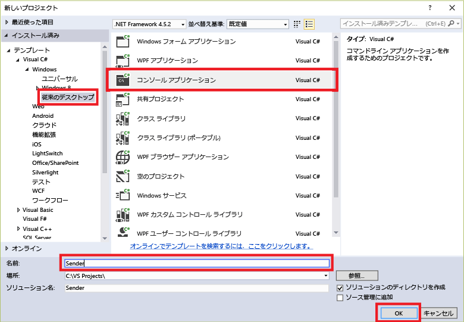

## Event Hub へのメッセージ送信

このセクションでは、Windows コンソール アプリを記述して、Event Hub にイベントを送信します。

1. Visual Studio で、**コンソール アプリケーション** プロジェクト テンプレートを使用して、新しい Visual C# のデスクトップ アプリ プロジェクトを作成します。プロジェクトの名前として「**Sender**」と入力します。

	

2. ソリューション エクスプローラーでソリューションを右クリックし、**[ソリューションの NuGet パッケージの管理]** をクリックします。

3. **[参照]** タブをクリックして、`Microsoft Azure Service Bus` を検索します。プロジェクト名 (**Sender**) が **[バージョン]** ボックスで指定されていることを確認します。**[インストール]** をクリックして、使用条件に同意します。

	

	Visual Studio によりパッケージのダウンロードとインストールが実行され、[Azure Service Bus ライブラリ NuGet パッケージ](https://www.nuget.org/packages/WindowsAzure.ServiceBus)への参照が追加されます。

4. **Program.cs** ファイルの先頭に次の `using` ステートメントを追加します。

	```
	using System.Threading;
	using Microsoft.ServiceBus.Messaging;
	```

5. **Program** クラスに次のフィールドを追加し、前のセクションで作成した Event Hub の名前と、先ほど保存した名前空間レベルの接続文字列を値に代入します。

	```
	static string eventHubName = "{Event Hub name}";
	static string connectionString = "{send connection string}";
	```

6. **Program** クラスに次のメソッドを追加します。

	```
	static void SendingRandomMessages()
	{
	    var eventHubClient = EventHubClient.CreateFromConnectionString(connectionString, eventHubName);
	    while (true)
	    {
	        try
	        {
	            var message = Guid.NewGuid().ToString();
	            Console.WriteLine("{0} > Sending message: {1}", DateTime.Now, message);
	            eventHubClient.Send(new EventData(Encoding.UTF8.GetBytes(message)));
	        }
	        catch (Exception exception)
	        {
	            Console.ForegroundColor = ConsoleColor.Red;
	            Console.WriteLine("{0} > Exception: {1}", DateTime.Now, exception.Message);
	            Console.ResetColor();
	        }

	        Thread.Sleep(200);
	    }
	}
	```

	このメソッドは、200 ミリ秒の遅延時間でイベント ハブにイベントを継続的に送信します。

7. 最後に、**Main** メソッドに次の行を追加します。

	```
	Console.WriteLine("Press Ctrl-C to stop the sender process");
	Console.WriteLine("Press Enter to start now");
	Console.ReadLine();
	SendingRandomMessages();
	```

<!---HONumber=AcomDC_0921_2016-->