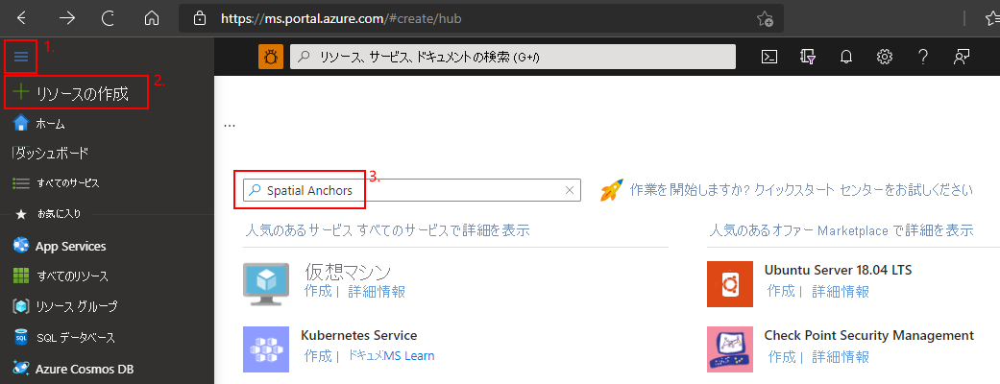
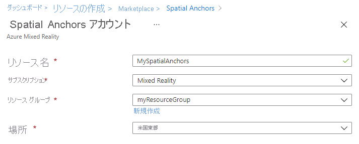
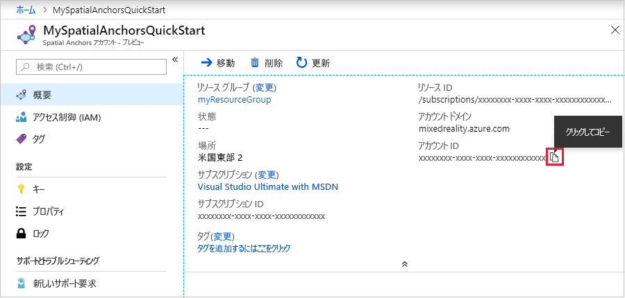
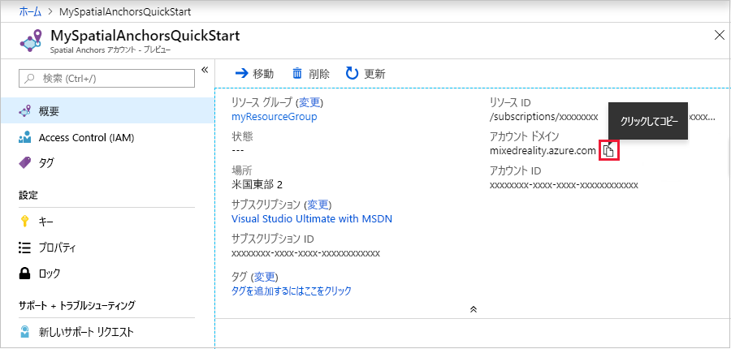

## Spatial Anchors リソースを作成する

<a href="https://portal.azure.com" target="_blank">Azure ポータル</a>にアクセスします。

Azure portal の左側のナビゲーション ウィンドウで、 **[リソースの作成]** を選択します。

検索ボックスを使用して、「**Spatial Anchors**」を検索します。

   

**[Spatial Anchors]** を選択します。 ダイアログ ボックスで **[作成]** を選択します。

**[Spatial Anchors アカウント]** ダイアログ ボックスで以下を行います。

- 通常の英数字を使用して、一意のリソース名を入力します。
- リソースをアタッチするサブスクリプションを選択します。
- **[新規作成]** を選択して、リソース グループを作成します。 「**myResourceGroup**」と名前を付け、 **[OK]** を選択します。
      [!INCLUDE [resource group intro text](resource-group.md)]
- リソースを配置する場所 (リージョン) を選択します。
- **[新規]** を選択して、リソースの作成を開始します。

   

リソースが作成されると、Azure portal に、デプロイが完了したことが表示されます。 **[リソースに移動]** をクリックします。

これで、リソースのプロパティを確認できます。 リソースの **[アカウント ID]** 値は、後で必要になるため、テキスト エディターにコピーしておきます。

   

また、リソースの **[アカウントのドメイン]** 値は、後で必要になるため、テキスト エディターにコピーします。

   

**[設定]** で **[キー]** を選択します。 **[主キー]** の値をテキスト エディターにコピーします。 この値は `Account Key` です この情報は後で必要になります。

   
