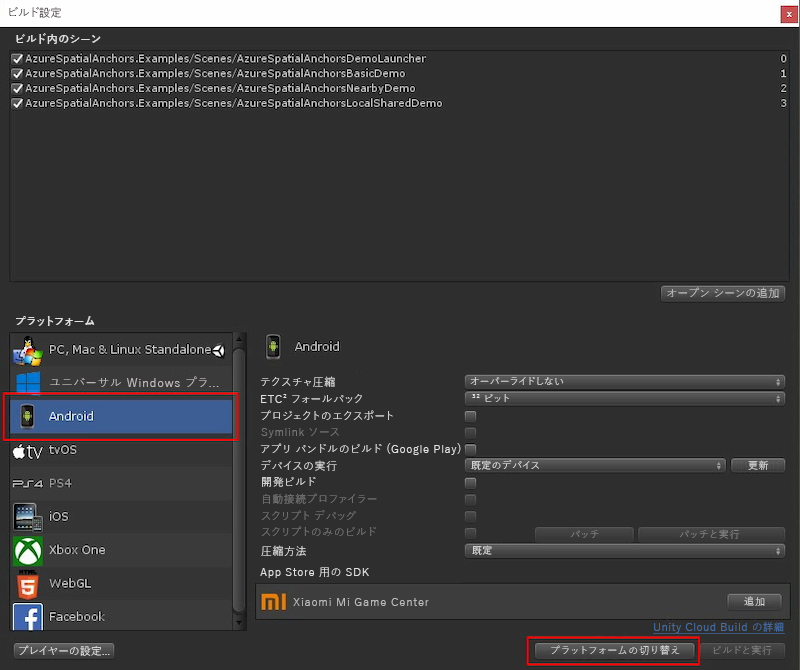

Unity を開き、`Unity` フォルダーのプロジェクトを開きます。

**[ファイル]** -> **[ビルド設定]** を選択して、**[ビルド設定]** を開きます。

**[プラットフォーム]** セクションで、**[Android]** を選択します。 次に、**[ビルド システム]** を **[Gradle]** に変更し、**[プロジェクトのエクスポート]** オプションをオンにします。

**[Switch Platform]\(プラットフォームの切り替え\)** を選択して、プラットフォームを **[Android]** に変更します。 Android をサポートするコンポーネントが不足している場合は、Unity によってそれらをインストールすることを要求される場合があります。

**[ビルド設定]** ウィンドウを閉じます。

### Unity 用 ARCore SDK をダウンロードしてインポートする

[Unity 用 ARCore SDK のリリース](https://github.com/google-ar/arcore-unity-sdk/releases/tag/v1.5.0)から `unitypackage` ファイルをダウンロードします。 Unity プロジェクトに戻り、**[Assets]\(資産\)** -> **[パッケージのインポート]** -> **[カスタム パッケージ...]** を選択した後、先ほどダウンロードした `unitypackage` ファイルを選択します。 **[Unity パッケージのインポート]** ダイアログ で、すべてのファイルが選択されていることを確認し、**[インポート]** を選択します。
