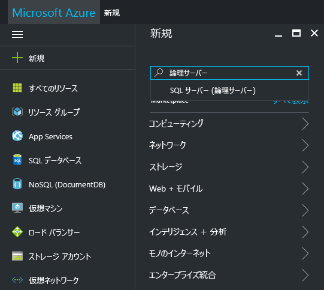
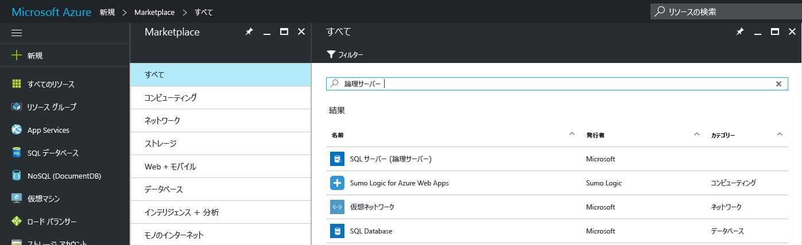
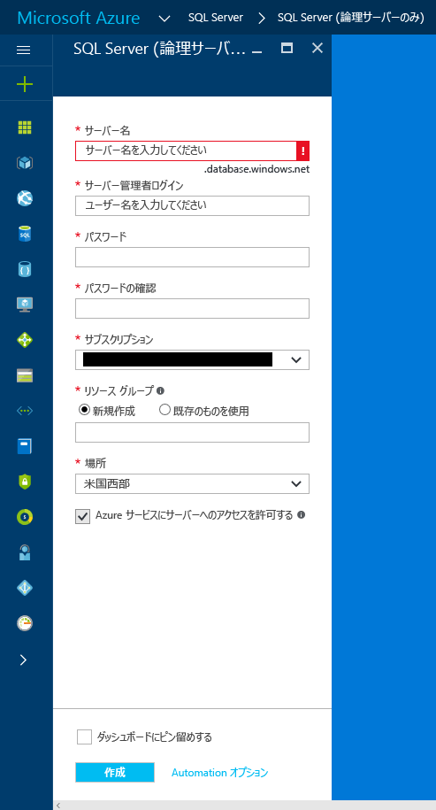
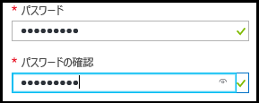
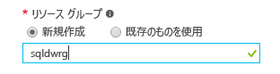

### Azure Portal で新しい論理 SQL サーバーを作成する

1. **[新規]** をクリックして、「**論理サーバー**」を検索し、**Enter** キーを押します。

    
2. **[SQL サーバー (論理サーバー)]** を選択します。 

    
  
3. **[作成]** をクリックして、新しい [SQL サーバー (論理サーバー)] ブレードを開きます。

   <kbd>  </kbd>
    <kbd> </kbd>
  
3. [SQL サーバー (論理サーバー)] ブレードの [サーバー名] ボックスに、新しい論理サーバーの有効な名前を指定します。 緑色のチェック マークは、入力した名前が有効であることを示しています。
    
    

    > [!IMPORTANT]
    > 新しいサーバーの完全修飾名は、<サーバー名>.database.windows.net になります。
    >
    
4. [サーバー管理者ログイン] ボックスに、このサーバーの SQL 認証ログイン用のユーザー名を指定します。 このログインは、サーバー プリンシパル ログインとも呼ばれます。 緑色のチェック マークは、入力した名前が有効であることを示しています。
    
    
5. **[パスワード]** ボックスと **[パスワードの確認]** ボックスに、サーバー プリンシパル ログイン アカウントのパスワードを指定します。 緑色のチェック マークは、入力したパスワードが有効であることを示しています。
    
    
6. オブジェクトを作成するアクセス許可があるサブスクリプションを選択します。

    
7. [リソース グループ] ボックスの **[新規作成]** を選択した後、[リソース グループ] ボックスに、新しいリソース グループに有効な名前を指定します (既にリソース グループを作成済みの場合は、既存のリソース グループを使用することもできます)。 緑色のチェック マークは、入力した名前が有効であることを示しています。

    

8. **[場所]** ボックスで、現在の場所に適したデータ センター ("オーストラリア東部" など) を選択します。
    
    
    
    > [!TIP]
    > このブレードの **[Azure サービスにサーバーへのアクセスを許可する]** チェック ボックスは変更できません。 この設定は、サーバー ファイアウォールのブレードで変更できます。 詳細については、[セキュリティの概要](../articles/sql-database/sql-database-manage-servers-portal.md)に関する記事を参照してください。
    >
    
9. **[作成]**をクリックします。

    ![[作成] ボタン](./media/sql-data-warehouse-create-logical-server/create.png)

