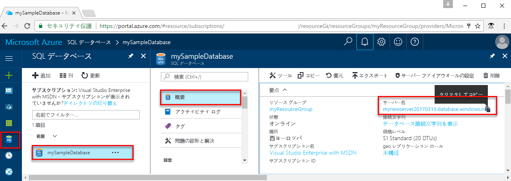

<!-- sql-database-connect-query-prerequisites-server-connection-info-includes.md 

## Get SQL server connection information
-->

Azure SQL データベースに接続するために必要な接続情報を取得します。 後の手順で、完全修飾サーバー名、データベース名、ログイン情報が必要になります。

1. [Azure Portal](https://portal.azure.com/) にサインインします。

1. 左側のメニューから **[SQL データベース]** を選択し、**[SQL データベース]** ページで目的のデータベースをクリックします。

1. データベースの **[概要]** ページで、**[サーバー名]** の隣の完全修飾サーバー名を確認します。 サーバー名をコピーするには、名前をポイントして **[コピー]** アイコンを選択します。  

ログイン情報を忘れた場合は、サーバー名を選択して **[SQL サーバー]** ページを開きます。 ここでは **[サーバー管理者]** の名前を確認でき、必要な場合は **[パスワードのリセット]** を選択できます。