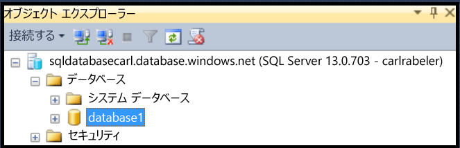
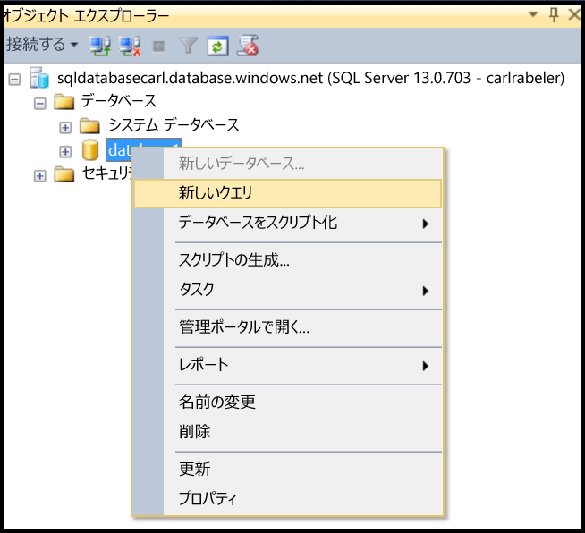
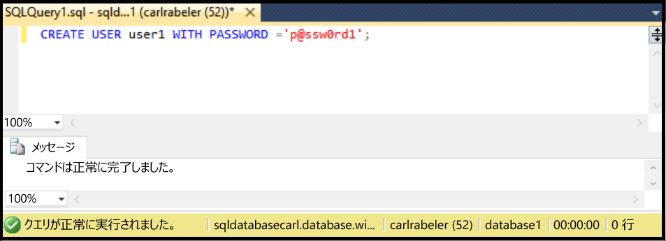

## SSMS を使用して新しいデータベース ユーザーを作成する

次の手順では、SSMS を使用しており、オブジェクト エクスプローラーで SQL Database に接続していて、サーバー レベルのプリンシパル管理者として、または新規ユーザー作成アクセス許可を持つユーザー アカウントで、SQL Database 論理サーバーに接続しているものとします。さらに、ユーザー アカウントを作成するユーザー データベースが存在しているものとします。

1. オブジェクト エクスプローラーで [データベース] ノードを展開し、新しいユーザー アカウントを作成するデータベースを選択します。

     

2. 選択したデータベースを右クリックし、**[クエリ]** をクリックします。

     

3. クエリ ウィンドウで、次の Transact-SQL ステートメントを編集して使用し、ユーザー データベースに含まれるユーザーを作成します。

    ```CREATE USER user1 WITH PASSWORD ='p@ssw0rd1';

     

<!---HONumber=AcomDC_0420_2016-->