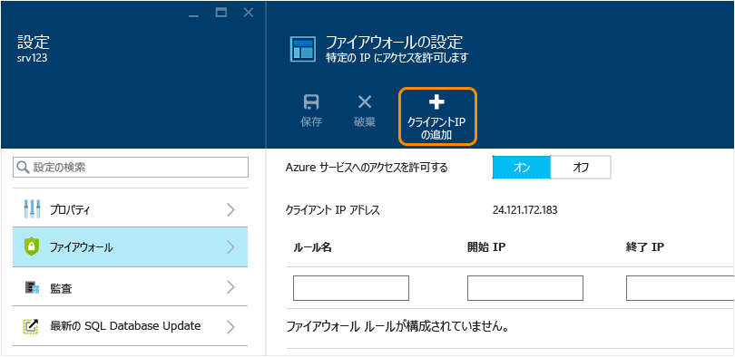

<!--
includes/sql-database-create-new-server-firewall-portal.md

Latest Freshness check:  2016-11-28 , rickbyh.

As of circa 2016-04-11, the following topics might include this include:
articles/sql-database/sql-database-get-started.md
articles/sql-database/sql-database-configure-firewall-settings
articles/sql-data-warehouse-get-started-provision.md

-->
### Azure ポータルで、サーバー レベルのファイアウォール ルールを作成します。

1. SQL server ブレードの 設定 をクリックして**ファイアウォール**を SQL server のファイアウォールのブレードを開きます。

    <!--  -->

2. 表示されたクライアントの IP アドレスを確認して、任意のブラウザーを使用して、インターネット上の IP アドレスであることを検証 (します確認メッセージ"とはコンピューターの IP アドレス)。 場合によってはさまざまな理由が一致しません。

    <!--  -->

3. 一致する IP アドレスと仮定する をクリックして**クライアントの ip アドレスを追加**ツールバー。

    

    > [!NOTE]
    > 単一の IP アドレスまたはアドレスの範囲全体をサーバー上の SQL データベース ファイアウォールを開くことができます。 ファイアウォールを開くには、SQL 管理者とユーザーがログインするサーバー上の任意のデータベースにある有効な資格情報が実行できます。
    >

4. をクリックして**保存**をこのサーバー レベルのファイアウォール ルールを保存し、をクリックし、ツールバーの**OK**です。

    

> [!Tip]
> チュートリアルについては、次を参照してください。 [SQL Database チュートリアル: サーバー、サーバー レベルのファイアウォール規則、サンプル データベース、データベース レベルのファイアウォール ルールを作成し、SQL Server と接続](../articles/sql-database/sql-database-get-started.md)です。    
>
