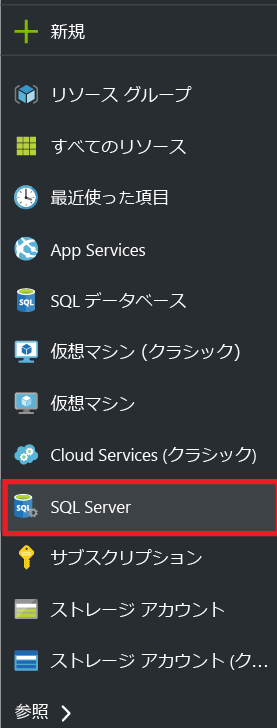
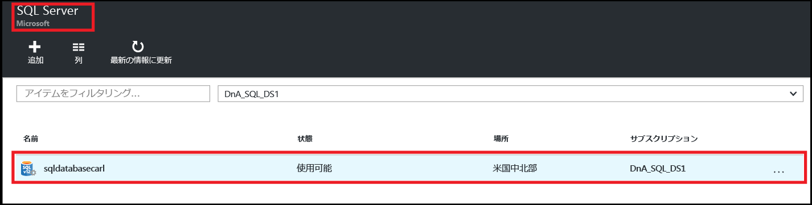
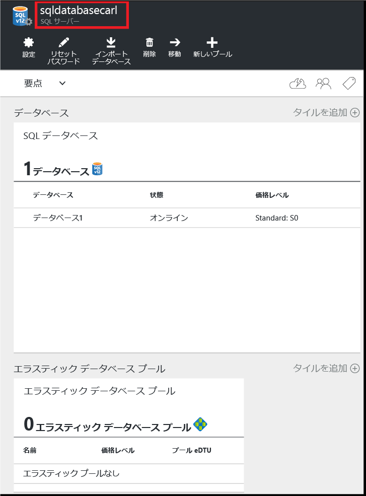
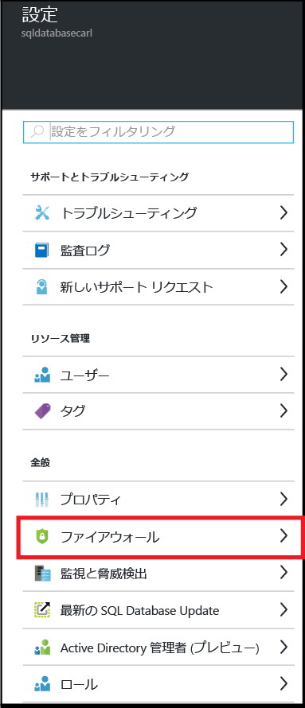
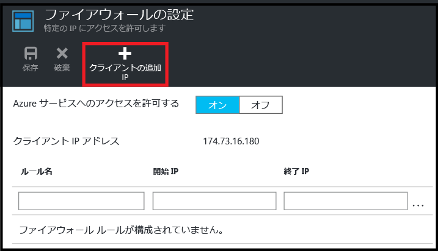
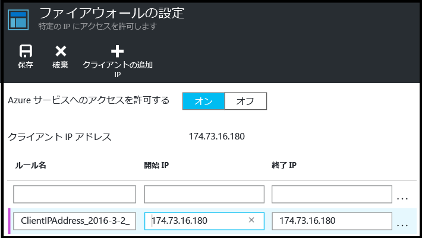
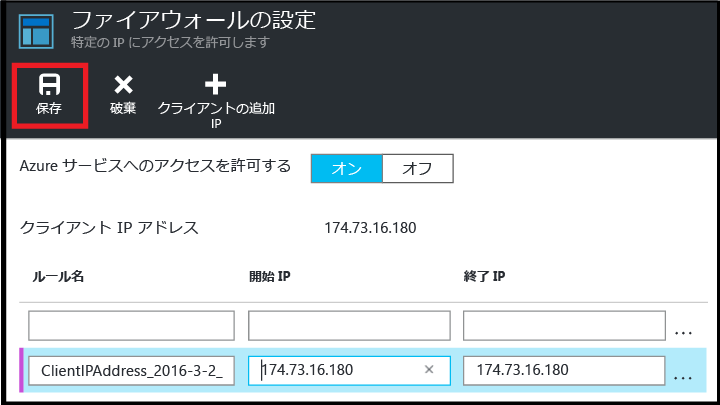

<!--
includes/sql-database-create-new-server-firewall-portal.md

Latest Freshness check:  2016-08-01 , rickbyh.

As of circa 2016-04-11, the following topics might include this include:
articles/sql-database/sql-database-get-started-tutorial.md
articles/sql-database/sql-database-configure-firewall-settings

-->
## 新しい Azure SQL Server レベル ファイアウォールを作成する

次の手順に従い、Azure ポータルで、個々の IP アドレス (クライアント コンピューター) または IP アドレスの範囲全体から SQL Database 論理サーバーに接続できるようなサーバーレベルのファイアウォール規則を作成します。

1. [Azure Portal](http://portal.azure.com) に接続していない場合は接続します。
2. 既定のブレードで、**[SQL Server]** をクリックします。

  	

3. **[SQL Server]** ブレードで、ファイアウォール規則を作成するサーバーをクリックします。

 	

4. サーバーのプロパティを確認します。

 	

5. **[設定]** ブレードで **[ファイアウォール]** をクリックします。

 	

 	> [AZURE.NOTE] サーバーレベルの **[ファイアウォール設定]** ブレードには、**[データベース]** ブレードのツール バーからアクセスすることもできます。

6. **[クライアント IP の追加]** をクリックすると、Azure でそのクライアント IP アドレスの規則が作成されます。

      

7. 必要に応じて、IP アドレスの範囲にアクセスできるように、追加した IP アドレスをクリックしてファイアウォール アドレスを編集します。

      

8. **[保存]** をクリックしてサーバーレベルのファイアウォール規則を作成します。

     

	>[AZURE.IMPORTANT] クライアント IP アドレスは不定期で変更される可能性があるため、新しいファイアウォール規則を作成するまでサーバーにアクセスできなくなる場合があります。[Bing](http://www.bing.com/search?q=my%20ip%20address) を使用して IP アドレスをチェックすることができます。その後、単一の IP アドレスまたは IP アドレスの範囲を追加します。詳細については、[ファイアウォール設定の管理](sql-database-configure-firewall-settings.md#manage-existing-server-level-firewall-rules-through-the-azure-portal)に関するセクションを参照してください。

<!---HONumber=AcomDC_0912_2016-->