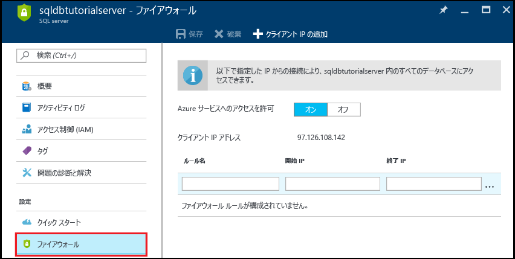
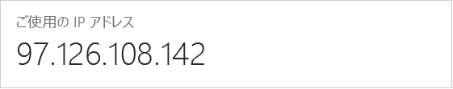
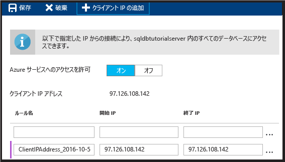
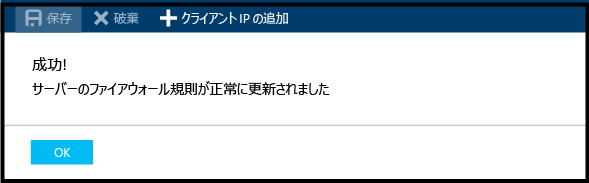

<!--
includes/sql-database-create-new-server-firewall-portal.md

Latest Freshness check:  2016-11-28 , rickbyh.

As of circa 2016-04-11, the following topics might include this include:
articles/sql-database/sql-database-get-started.md
articles/sql-database/sql-database-configure-firewall-settings
articles/sql-data-warehouse-get-started-provision.md

-->
### Azure Portal でサーバーレベルのファイアウォール規則を作成する

1. [SQL Server] ブレードで、[設定] の下にある **[ファイアウォール]** をクリックして、SQL Server のファイアウォール ブレードを開きます。

    
    
2. 表示されたクライアント IP アドレスを確認し、任意のブラウザーを使用してこれがインターネット上の自分の IP アドレスであることを確認します ("what is my IP address" を検索します)。 場合によっては、さまざまな理由により一致しないことがあります。

    

3. ID アドレスが一致したと仮定し、ツール バーの **[クライアント IP の追加]** をクリックします。

    

    > [!NOTE]
    > サーバー上の SQL Database ファイアウォールは、1 つの IP アドレスに対して開くことも、範囲全体のアドレスに対して開くこともできます。 ファイアウォールを開くと、SQL の管理者とユーザーは、有効な資格情報を持っているサーバー上の任意のデータベースにログインできます。
    >

4. ツール バーの **[保存]** をクリックしてこのサーバーレベルのファイアウォール規則を保存し、**[OK]** をクリックします。

    

> [!Tip]
> チュートリアルについては、[サーバー、サーバーレベルのファイアウォール規則、サンプル データベース、データベースレベルのファイアウォール規則の作成と SQL Server への接続に関する SQL Database のチュートリアル](../articles/sql-database/sql-database-get-started.md)を参照してください。    
>

<!--HONumber=Jan17_HO1-->

