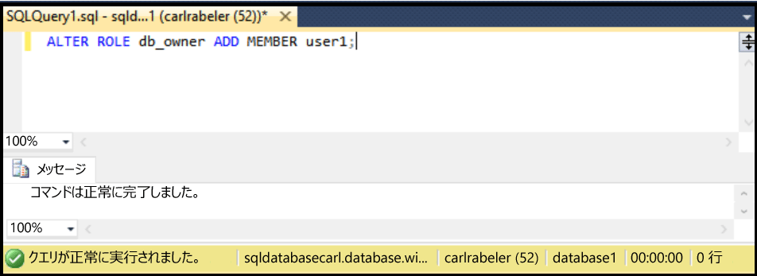

## 新しいデータベース ユーザーに db\_owner 権限を付与する

既存のデータベース ユーザーに db\_owner 権限を付与するには、以下の手順に従います。

ここでは、SSMS のオブジェクト エクスプローラーで SQL Database に接続していること、サーバー レベルのプリンシパル管理者として、またはユーザーに権限を付与するための権限を持ったユーザー アカウントで、SQL Database 論理サーバーに接続していることを前提としています。

1. オブジェクト エクスプローラーで [データベース] ノードを展開し、dbo アクセス許可を付与するユーザーのデータベースを選択します。

     

2. 選択したデータベースを右クリックし、**[クエリ]** をクリックします。

     

3. クエリ ウィンドウで、次の Transact-SQL ステートメントを編集して使用し、dbo アクセス許可を指定したユーザーに付与します。

    '''ALTER ROLE db\_owner ADD MEMBER user1;

     

<!---HONumber=AcomDC_0504_2016-->