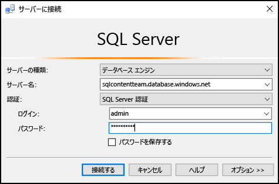
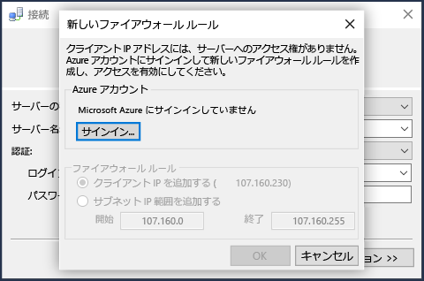
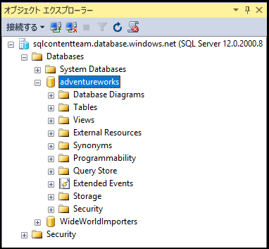

## SQL Server 認証を使用して Azure SQL Database に接続する

以下の手順は、SSMS で Azure SQL サーバーおよびデータベースに接続する方法を示しています。サーバーとデータベースがない場合は、[数分で SQL データベースを作成する](../articles/sql-database/sql-database-get-started.md)方法に関するページを参照して、作成してください。

1. Windows 検索ボックスで、「**Microsoft SQL Server Management Studio**」と入力して SSMS を起動し、デスクトップ アプリをクリックします。

2. **[サーバーへの接続]** ウィンドウで、次の情報を入力してください (SSMS が既に実行されている場合は、**[接続]、[データベース エンジン]** の順にクリックして、**[サーバーへの接続]** ウィンドウを開きます)。

 - **[サーバーの種類]**: 既定ではデータベース エンジンです。この値は変更しないでください。
 - **[サーバー名]**: Azure SQL Database サーバーの完全修飾名を、*&lt;サーバー名>*.**database.windows.net** の形式で入力します。
 - **[認証の種類]**: この記事では、**SQL Server 認証**を使用して接続する方法を示しています。Azure Active Directory での接続の詳細については、「[Active Directory 統合認証を使用して接続する](../articles/sql-database/sql-database-aad-authentication.md#connect-using-active-directory-integrated-authentication)」、「[Active Directory パスワード認証を使用して接続する](../articles/sql-database/sql-database-aad-authentication.md#connect-using-active-directory-password-authentication)」、[Active Directory ユニバーサル認証を使用した接続](../articles/sql-database/sql-database-ssms-mfa-authentication.md)に関するページを参照してください。
 - **[ユーザー名]**: サーバー上のデータベースへのアクセス権を持つユーザー (たとえば、サーバーを作成するときにセットアップした "*サーバー管理者*") の名前を入力してください。
 - **[パスワード]**: 指定したユーザーのパスワード (たとえば、サーバーを作成するときにセットアップした "*パスワード*") を入力してください。
   
       

3. **[接続]** をクリックします。
 
4. 既定では、新しいサーバーには定義済みの[ファイアウォール規則](../articles/sql-database/sql-database-firewall-configure.md)がないため、クライアントは最初は接続をブロックされます。特定の IP アドレスに接続を許可するファイアウォール規則がまだサーバーにない場合は、SSMS によって、サーバー レベルのファイアウォール規則を作成するように求められます。

    **[サインイン]** をクリックして、サーバー レベルのファイアウォール規則を作成します。サーバー レベルのファイアウォール規則を作成するには、Azure 管理者である必要があります。
 
       
 

5. Azure SQL データベースに正常に接続すると、**オブジェクト エクスプローラー**が開かれます。これで、データベースにアクセスして、[管理タスクの実行やデータの照会](../articles/sql-database/sql-database-manage-azure-ssms.md)ができるようになります。
 
     
 
     
## ## 接続に関するエラーのトラブルシューティング

接続エラーの最も一般的な理由は、サーバー名の間違いと、ネットワーク接続の問題です。<*servername*> はデータベースではなくサーバーの名前であり、完全修飾サーバー名 (`<servername>.database.windows.net`) を指定する必要があることに注意してください。

また、ユーザー名とパスワードに入力ミスや余分なスペースが含まれていないことを確認してください (ユーザー名では大文字と小文字が区別されませんが、パスワードでは区別されます)。

サーバー名と共にプロトコルとポート番号を `tcp:servername.database.windows.net,1433` のように明示的に設定することもできます。

ネットワーク接続の問題によって、接続エラーとタイムアウトが発生することもあります。サーバー名、資格情報、およびファイアウォール規則が正しいことを確認してから、単に接続を再試行すると、成功する可能性があります。

<!---HONumber=AcomDC_0824_2016-->