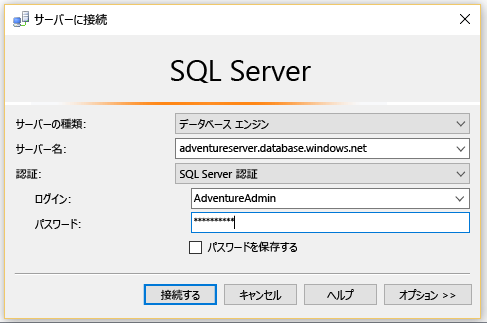
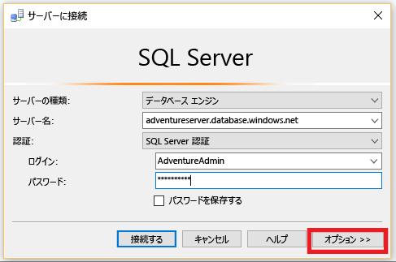
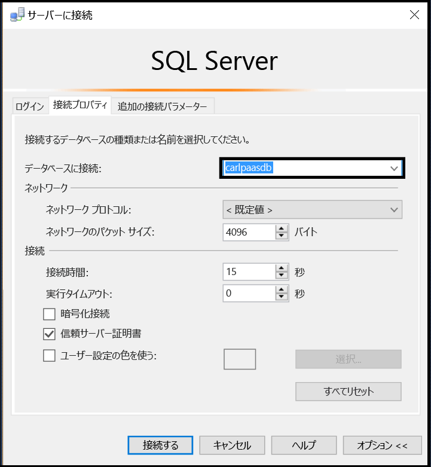
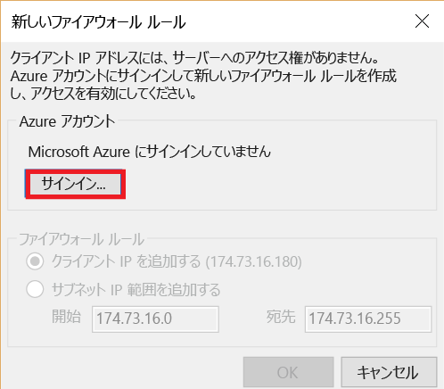
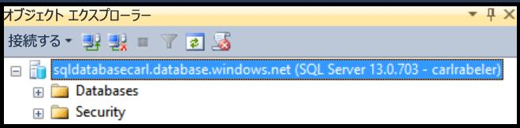

## Azure SQL Database にユーザーとして接続する
ユーザーとして SSMS で Azure SQL Database に接続するには、次の手順を使用します。

1. Windows 検索ボックスで、「Microsoft SQL Server Management Studio」と入力し、デスクトップ アプリをクリックして SSMS を起動します。
2. [サーバーへの接続] ウィンドウで次の情報を入力します。

* **[サーバーの種類]**: 既定値はデータベース エンジンです。この値は変更しないでください。
  
  * **[サーバー名]**: *&lt;servername>*.**database.windows.net** の形式で、SQL Database をホストするサーバーの名前を入力します。
  * **[認証の種類]**: 最初は [SQL 認証] を選択します。 SQL Database 論理サーバーで Active Directory を有効にしてある場合は、[Active Directory パスワード認証] または [Active Directory 統合認証] を選択できます。
  * **[ユーザー名]**: [SQL 認証] または [Active Directory パスワード認証] を選択した場合は、サーバーでデータベースへのアクセス権を持つユーザーの名前を入力します。
  * **[パスワード]**: [SQL 認証] または [Active Directory パスワード認証] を選択した場合は、指定したユーザーのパスワードを入力します。
    
       

1. **[オプション]** をクリックして、接続するデータベースを指定します。
   
      
2. **[データベースへの接続]**で、接続するデータベースを選択します。
   
     
3. **[接続]**をクリックします。
4. クライアントの IP アドレスが SQL Database 論理サーバーへのアクセス権を持たない場合は、Azure アカウントにサインインしてサーバー レベルのファイアウォール規則を作成するように求められます。 Azure サブスクリプション管理者の場合は、 **[サインイン]** をクリックして、サーバー レベルのファイアウォール規則を作成します。 それ以外の場合は、管理者に、サーバー レベルのファイアウォール規則または接続しようとしているデータベースでのデータベース レベルのファイアウォール規則を作成してもらいます。
   
      
5. 資格情報で指定したデータベースにアクセスできる場合、オブジェクト エクスプローラーが開き、ユーザーのアクセス許可に応じて、管理タスクやデータのクエリを実行できます。
   
      

## ## 接続に関するエラーのトラブルシューティング
接続の失敗の最も一般的な原因は、サーバー名、(<*servername*> はデータベースではなく論理サーバーの名前であることに注意)、ユーザー名、またはパスワードの間違いと、セキュリティ上の理由からサーバーが接続を許可しないことです。 

<!--HONumber=Nov16_HO2-->

